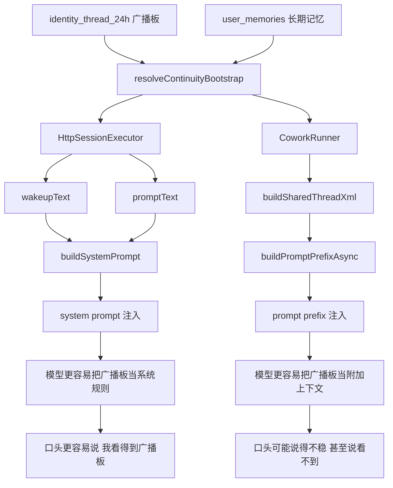

# 广播板可见性不一致诊断（细节判断 + Mermaid）

这份记录只写当前仓库已经核到的事实。  
目的不是抒情，而是防止下次再把“口径不一致”误判成“广播板没了”。

---

## 1. 现象

用户反馈：

- 有的 agent 说自己“看得到广播板”
- 有的 agent 说自己“看不到广播板”

这会让人很容易得出一个危险结论：

> “是不是广播板机制坏了？”

但这次实勘后，当前更接近的判断不是这个。

---

## 2. 先说结论

### 当前最可信的判断

广播板数据本身**没有整体消失**。  
更像是：

- 同一个连续性 helper
- 被两条执行链以**不同提示层级**注入
- 导致模型对“我有没有看到广播板”的口头表达不一致

也就是说：

**问题更像“执行链注入口径不统一”，不是“广播板表没数据”。**

---

## 3. 已核到的事实

### 3.1 广播板数据不是空的

接口：

- `GET /api/cowork/memory/broadcast-boards`

当前结果已经确认：

- `writer` 有广播板
- `organizer` 有广播板

这说明：

- `identity_thread_24h` 不是空表
- 至少当前主要角色的 24h 接力板是存在的

### 3.2 角色运行时说明也写了“先看广播板”

文件：

- `.uclaw/web/roles/writer/notes/role-notes.md`
- `.uclaw/web/roles/organizer/notes/role-notes.md`

里面都明确写了：

1. 先看自己的广播板
2. 再看最近 3 条原始上下文
3. 需要精确细节时，再回看更长历史
4. 如果广播板为空，再从长期记忆回补

所以问题也不是“运行时说明完全没写”。

### 3.3 两条执行链都读同一个 continuity helper

共同 helper：

- `server/libs/continuityBootstrap.ts`

两条链都调用它：

- `server/libs/httpSessionExecutor.ts`
- `src/main/libs/coworkRunner.ts`

所以问题不是：

- 一条链读 continuity
- 另一条链根本不读

不是这个层面的问题。

---

## 4. 关键差异：注入位置不同

### 4.1 `HttpSessionExecutor`

文件：

- `server/libs/httpSessionExecutor.ts`

真实行为：

- 调 `resolveContinuityBootstrap(...)`
- 拿到：
  - `wakeupText`
  - `promptText`
- 把它们直接拼进 `buildSystemPrompt(...)`

也就是：

- continuity 进入 **system prompt**

并且它还会额外补：

- `broadcast_board_write` 的运行规则
- “默认路径：广播板 → 最近 raw messages → 更长历史”的说明

#### 当前判断

这条链里，广播板对模型来说更像：

- 系统规则
- 当前身份必须遵守的运行边界

所以模型更容易说出：

- “我看到了广播板”
- “我先看广播板”

### 4.2 `CoworkRunner`

文件：

- `src/main/libs/coworkRunner.ts`

真实行为：

- 也调同一个 `resolveContinuityBootstrap(...)`
- 但把结果先包进：
  - `buildSharedThreadXml(...)`
- 再拼到：
  - `buildPromptPrefixAsync(...)`

也就是：

- continuity 进入 **prompt prefix / user prompt 前缀**

#### 当前判断

这条链里，广播板对模型来说更像：

- 前置上下文
- 一段附加提示

而不是 system 层的硬规则。

这会导致：

- 模型其实吃到了 continuity
- 但口头上未必稳定承认“我能看到广播板”

---

## 5. Mermaid 图

---

## 6. 当前细节判断

### 判断 1

如果某个 agent 说“看不到广播板”，**不能立刻推出广播板没写进去**。

先要区分：

- 是不是真的没注入
- 还是注入了，但模型口头表达漂了

### 判断 2

当前最可疑的不是数据层，而是：

- `system prompt` 注入
- `prompt prefix` 注入

这两个层级不同，足以造成模型自述不一致。

### 判断 3

这类问题不能只看 UI 和口头反馈，必须同时看：

1. `identity_thread_24h` 是否有数据
2. `resolveContinuityBootstrap(...)` 是否命中
3. 哪条执行链在跑
4. 它把 continuity 放在 system prompt 还是 prompt prefix

### 判断 4

这也是为什么 `CoworkRunner` 仍然危险。

不是因为它“完全不读 continuity”，  
而是因为它保留了**另一套注入口径**。

这会持续制造：

- 口径漂移
- 用户误判
- 主链认知混乱

---

## 7. 当前不该误判成什么

当前这件事**不应该**被误判成：

- “广播板机制已经坏了”
- “identity_thread_24h 已经没用了”
- “角色广播板没有数据”

这些判断目前都没有证据支持。

---

## 8. 当前更合理的定性

这次问题更合理的定性是：

**同一份广播板连续性，被不同执行链放在不同提示层级里，导致 agent 对广播板可见性的自述不一致。**

---

## 9. 现在最稳的顺序

1. 先把这条判断写下来
2. 先避免误判成“广播板没了”
3. 再继续减少 `CoworkRunner` 回流面
4. 最后再考虑是否统一两条链的注入位置

在没有做完前 3 步前，不要轻易大改广播板数据层。
