# 修复板块总图（认真版）

这份文档不跳着写。  
它按板块把当前项目里：

- 已经修好的地方
- 还没修好的地方
- 为什么这样判断

一块一块写清楚。  
并且用 Mermaid 画出来。

约定：

- **绿色** = 当前已经修好/基本稳住
- **红色** = 当前还没收口/待修复
- **黄色** = 已有方向，但还要继续验证

---

## 1. 当前总判断

当前项目不是“整体都坏了”。  
更准确的说法是：

- 主线方向已经被拉回来了
- 一些关键事故已经修掉了
- 但仍有几个旧污染口在回流
- UI 侧的状态透明还不够

所以现在最需要的是：

1. 不要再误判
2. 不要再把旧链当主链
3. 把已经修好的地方画清楚
4. 把待修复的红区明确钉出来

---

## 2. 已修好的板块

### 2.1 附件分片落盘路径

已经修好的内容：

- 分片文件不再只漂到 `.uclaw/web/attachments`
- 现在会优先跟随：
  1. 前端显式 `cwd`
  2. `coworkConfig.workingDirectory`
  3. `workspaceRoot`
  4. 用户设置的对话文件目录
  5. 最后才退到用户数据目录

当前判断：

- **这块已经修好**

相关文件：

- `server/routes/dialog.ts`
- `docs/ATTACHMENT_ROUTING_POSTMORTEM_2026-03-30.md`

### 2.2 附件误走网页观察工具

已经修好的内容：

- 本地文本分片路径不再让 `browser_observe_page` 抢道
- 有附件时，附件读取链优先

当前判断：

- **这块已经修好**

相关文件：

- `server/libs/httpSessionExecutor.ts`
- `src/shared/nativeCapabilities/browserEyesAddon.ts`

### 2.3 附件读取工具面

已经修好的内容：

- 新增：
  - `attachment_manifest`
  - `attachment_read`
- 分片/多文件不再默认全文硬塞 prompt
- 开始走“索引 + 按需读取”

当前判断：

- **功能已经打通**
- 但 UI 的进度展示还没完全收口

相关文件：

- `server/libs/attachmentRuntime.ts`
- `server/libs/httpSessionExecutor.ts`
- `src/shared/attachmentChunkMetadata.ts`

### 2.4 定时任务通知止血

已经修好的内容：

- 前端 IM 通知入口已止血，不再继续误导
- 详情页明确提示“当前未接线”
- 新增文本版 `completionWebhookUrl`
- 支持：
  - `{{这里面是回调的文字内容}}`
  - 企业微信机器人 webhook 直接 POST text

当前判断：

- **止血已完成**
- **最小可用 webhook 已完成**
- 但不是最终长期方案

相关文件：

- `src/renderer/components/scheduledTasks/TaskForm.tsx`
- `src/renderer/components/scheduledTasks/TaskDetail.tsx`
- `src/main/libs/scheduler.ts`
- `src/main/scheduledTaskStore.ts`
- `src/main/sqliteStore.ts`
- `server/sqliteStore.web.ts`

### 2.5 项目立意与边界文档

已经补好的内容：

- 项目立意
- 高代价踩坑边界
- roles 是他们各自的家
- 日记接力与房间边界
- 项目一句话总纲

当前判断：

- **文档入口已经补好**

相关文件：

- `docs/2026-03-30_215514_PROJECT_INTENT_READ_ME_FIRST.md`
- `docs/HIGH_COST_BOUNDARIES_READ_ME_FIRST_2026-03-30.md`
- `docs/2026-03-30_225432_ROLES_HOME_BOUNDARY.md`
- `docs/2026-03-30_230059_DIARY_RELAY_AND_ROOMS_BOUNDARY.md`
- `docs/2026-03-30_230300_PROJECT_ONE_SENTENCE_PRINCIPLE.md`

### 2.6 writer 的 IMA 串线

已经修好的内容：

- 关闭了 `writer` 的 `IMA 笔记` native capability
- 实测 `writer` 工具表里不再出现：
  - `ima_search_notes`
  - `ima_get_note`
  - `ima_create_note`

当前判断：

- **这块已经修好**

相关位置：

- `app_config.nativeCapabilities`
- `.uclaw/web/roles/writer/role-settings.json`

### 2.7 PC -> 微信 跨频道数字接龙

实测结果：

- PC 对话后切到微信对话
- 数字接龙成功
- 跨频道记忆接力正常

当前判断：

- **这块当前通过**

### 2.8 能力调用加载 / 工具选择

实测结果：

- 能力调用加载正常
- 工具选择方向正确

当前判断：

- **这块当前通过**

### 2.9 对话过程的大文件分割与读取

实测结果：

- 对话过程中的大文件分割正常
- 分片后的读取链正常
- 之前已经完成过实测验证

当前判断：

- **这块当前通过**

### 2.10 记忆管理中的广播板可观测性

实测结果：

- 记忆管理页面里已经能看见广播板内容

当前判断：

- **广播板观察窗当前可见**
- 但“对话页是否明确显示这轮命中来源”仍然是另一件待收口的事

### 2.11 飞书 gateway 重启恢复

实测结果：

- 之前飞书有配置但不回信
- 查到是对应 gateway 没在线
- 重启后恢复正常
- 重新测试后已有回复

当前判断：

- **这块当前恢复**
- 后续仍要继续关注“多 app gateway 在线状态”是否稳定

---

## 3. 还没修好的板块

### 3.1 广播板可见性一致性

当前问题：

- 广播板数据在
- 角色运行时说明也在
- 但不同 agent 口头反馈不一致

当前最可信判断：

- `HttpSessionExecutor` 把 continuity 放在 `system prompt`
- `CoworkRunner` 把 continuity 放在 `prompt prefix`

所以问题不是“广播板没了”，而是：

- **执行链注入层级不一致**

当前判断：

- **这块还没修**

相关文件：

- `server/libs/httpSessionExecutor.ts`
- `src/main/libs/coworkRunner.ts`
- `docs/2026-03-30_220305_BROADCAST_VISIBILITY_CHAIN_DIAGNOSIS.md`

### 3.2 `CoworkRunner` 遗留回流

当前问题：

- 主链一直在尽量绕开它
- 但它还没死透
- 特别是在定时任务链和旧兼容语义里，还保留回退活口

当前判断：

- **这是高风险红区**

因为它会继续带来：

- 连续性口径不一致
- 结果压缩
- agent → RPA 回流

相关文件：

- `src/main/libs/scheduler.ts`
- `src/main/libs/coworkRunner.ts`
- `docs/CONTINUITY_DISTORTION_FINDINGS_2026-03-30.md`

### 3.3 对话页状态透明还不够

当前问题：

- 附件读取进度虽然有工具摘要
- 但还不是一等状态
- 用户仍要自己从工具卡片猜“读到第几片了”

还差的内容：

- 当前源文件名
- 当前 `x/y`
- 已完成片号
- continuity 命中来源标签

当前判断：

- **这块还没收口**

相关文件：

- `src/renderer/components/cowork/CoworkSessionDetail.tsx`
- `src/renderer/components/cowork/sessionDetailHelpers.ts`

### 3.4 角色房间里的内容治理

当前问题：

- `roles` 目录结构方向是对的
- 但房间里放了什么，还需要继续治理
- 尤其是某些 role-bound skills 会抢主线

当前明显风险：

- `writer` 当前被绑定了 `xias-ai-short-drama-toolbox-v1`
- 很可能会抢写作主线

当前判断：

- **结构没错，内容还要继续清**
- `writer` 当前“像中毒”更可信的判断是：
  1. `xias-ai-short-drama-toolbox-v1` 抢主线
  2. `gpt-5.4` 这路上游不稳
  3. 两者叠加

- 另外当前已确认：
  - `ima_*` 不属于普通 marketplace skill
  - 它属于 `nativeCapabilities`
  - 前端设置页其实有“外挂能力”开关
  - `writer` 的 `IMA` 与 `小眼睛` 已关闭，并与角色房间视图对齐

相关文件：

- `.uclaw/web/roles/writer/skills.json`
- `.uclaw/web/roles/writer/role-capabilities.json`

### 3.5 webhook 稳定性

当前问题：

- 现在的 webhook 是最小可用版
- 还没有：
  - 重试
  - 幂等
  - 发送记录
  - UI 回显

当前判断：

- **可用，但还是黄色，不是最终形态**

相关文件：

- `src/main/libs/scheduler.ts`

### 3.6 缓存命中率不足

当前问题：

- 成本偏高
- 现有缓存层还不够深、不够稳
- 如果后面在没做好缓存命中的情况下直接降本，最危险的做法就会变成：
  - 砍记忆
  - 砍连续性
  - 砍日记
  - 砍过程信息
  - 把 agent 压回一次一句

当前判断：

- **这是高优先级红区**
- 缓存命中不是小优化，而是保护“人味/连续性/记忆”不被拿去换成本的防线

相关文件：

- `server/libs/turnCache.ts`
- `server/libs/httpSessionExecutor.ts`
- `src/renderer/components/cowork/CoworkSessionDetail.tsx`

### 3.7 配置修改后生效反馈缺失

当前问题：

- 用户修改了飞书配置
- 但在线 gateway 不一定立刻同步
- 用户不知道“到底生效了没有”
- 于是会反复修改配置

后果：

- 配置越改越乱
- 问题越查越像玄学
- 用户会误以为是自己填错了

当前判断：

- **这是可以用简单方式先止血的红区**

最简单可做的方向：

1. 明确提示：
   - 修改配置后，如未及时生效，请点击“重启飞书网关 / 刷新配置”
2. 给出一个明显按钮：
   - `重启飞书网关`
   - 或 `卡住了？刷新飞书连接`
3. 在页面上显示：
   - 配置中的 app 数量
   - 当前在线 gateway 数量
   - 是否一致

---

## 4. Mermaid 总图

```mermaid
flowchart TD
    A[项目主线]:::core

    A --> B[附件分片落盘路径]:::fixed
    A --> C[附件误走网页工具]:::fixed
    A --> D[附件读取工具面]:::fixed
    A --> E[定时任务通知止血]:::fixed
    A --> F[项目立意与边界文档]:::fixed

    A --> G[广播板可见性一致性]:::todo
    A --> H[CoworkRunner 遗留回流]:::todo
    A --> I[对话页状态透明]:::todo
    A --> J[角色房间内容治理]:::todo
    A --> K[webhook 稳定性增强]:::inprogress

    B --> B1[dialog.ts 目录真相源修正]:::fixed
    C --> C1[browser_observe_page 不再抢附件]:::fixed
    D --> D1[attachment_manifest]:::fixed
    D --> D2[attachment_read]:::fixed
    E --> E1[IM 通知入口止血]:::fixed
    E --> E2[文本 webhook 最小可用]:::fixed
    F --> F1[项目立意]:::fixed
    F --> F2[roles 是家]:::fixed
    F --> F3[日记接力]:::fixed
    F --> F4[一句话总纲]:::fixed

    G --> G1[HttpSessionExecutor: system prompt]:::todo
    G --> G2[CoworkRunner: prompt prefix]:::todo

    H --> H1[Scheduler fallback]:::todo
    H --> H2[旧执行壳压缩语义]:::todo

    I --> I1[附件读取 x/y 显示不足]:::todo
    I --> I2[continuity source 标签缺失]:::todo

    J --> J1[writer 绑定 skill 抢主线]:::todo
    J --> J2[pitfalls/notes 仍偏空]:::todo

    K --> K1[重试/幂等/记录/回显]:::inprogress

    classDef fixed fill:#daf5d7,stroke:#2f7d32,color:#153b17,stroke-width:2px;
    classDef todo fill:#ffd9d9,stroke:#b42318,color:#5c1111,stroke-width:2px;
    classDef inprogress fill:#fff2cc,stroke:#b7791f,color:#5a3a00,stroke-width:2px;
    classDef core fill:#dbeafe,stroke:#1d4ed8,color:#102a43,stroke-width:2px;
```

---

## 5. 先做什么

最稳的顺序还是：

1. 先守住已经修好的，不要再回退
2. 先收广播板可见性一致性
3. 再继续减少 `CoworkRunner` 活口
4. 再补 UI 的强状态透明
5. 最后再做 webhook 的增强

不要反过来。  
不要先做花的。  
不要再把主线做重。
