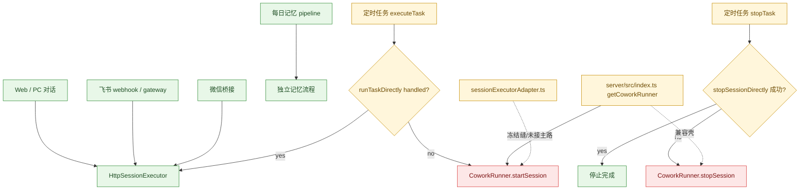

# CoworkRunner 老链路范围与切除顺序

时间：2026-03-31 04:35:22

这份文档只做一件事：

- 把 `CoworkRunner` 现在到底还活在哪
- 哪些只是壳，哪些是真活口
- 下一刀最稳应该切哪里

不跳结论，不混 UI，不混附件，不混飞书表象。

---

## 1. 当前结论

`CoworkRunner` 已经**不是现役对话主链**。

当前现役主链是：

- Web / PC 对话：`server/routes/cowork.ts -> HttpSessionExecutor`
- 飞书：`server/routes/feishuWebhook.ts` / `server/libs/feishuGateway.ts` -> `HttpSessionExecutor`
- 微信桥接：`server/libs/wechatbotGateway.ts -> HttpSessionExecutor`
- 每日记忆：`dailyMemoryPipeline` 直跑，不走 `CoworkRunner`

`CoworkRunner` 现在主要剩下三种形态：

1. **遗留执行缝**
   - `scheduler.ts` 里的旧回退执行口代码仍在
   - 但当前 server runtime 已封死，不再允许 `executeTask()` 回退命中
2. **遗留停止缝**
   - `scheduler.ts` 里的旧停止兜底代码仍在
   - 当前 server runtime 未注入 `getCoworkRunner`，只在未来误接回时才会重新带电
3. **兼容壳**
   - `server/src/index.ts` 的惰性单例 `getCoworkRunner()`
   - `RequestContext.coworkRunner` getter
4. **冻结缝**
   - `server/libs/sessionExecutorAdapter.ts`
   - 目前仓库内没有调用方，属于“还在，但没接主路”

所以当前判断不是“整个系统还靠 `CoworkRunner` 跑”。
更准确的说法是：

> 主链已经换轨，旧发动机还在机房里；定时任务的旧点火线还没拆干净，但这轮已经先把电闸按下去了。

---

## 2. 直接引用清单

### 2.1 真正直接引用 `CoworkRunner` 的文件

| 文件 | 角色 | 当前状态 | 判断 |
|---|---|---|---|
| `server/src/index.ts` | 服务端创建惰性单例 | 仍存在 | 兼容壳 |
| `src/main/libs/scheduler.ts` | 定时任务执行与停止兜底 | 仍存在 | 真活口 |
| `server/libs/sessionExecutorAdapter.ts` | 新编排层回退旧执行器的适配缝 | 仓库内未接入 | 冻结缝 |

### 2.2 明确已脱离 `CoworkRunner` 的主链

| 文件 | 业务 | 当前执行器 | 判断 |
|---|---|---|---|
| `server/routes/cowork.ts` | Web / PC 对话 | `HttpSessionExecutor` | 已脱主链 |
| `server/routes/feishuWebhook.ts` | 飞书 webhook 入站 | `HttpSessionExecutor` | 已脱主链 |
| `server/libs/feishuGateway.ts` | 飞书 ws / 网关 | `HttpSessionExecutor` | 已脱主链 |
| `server/libs/wechatbotGateway.ts` | 微信桥接 | `HttpSessionExecutor` | 已脱主链 |
| `server/libs/dailyMemoryPipeline.ts` | 每日记忆抽取 | 独立 pipeline | 已脱主链 |
| `server/routes/dailyMemory.ts` | 手动日记/记忆触发 | 独立 pipeline | 已脱主链 |

---

## 3. 真实业务流判断

### 3.1 Web / PC 对话

已经明确走：

- `server/routes/cowork.ts`
- `getOrCreateWebSessionExecutor(...)`
- `HttpSessionExecutor.startSession / continueSession`

并且代码里已经有明确标记：

- `当前稳定主链统一走 HttpSessionExecutor`
- `Web 轻链已禁止回退旧 CoworkRunner`

所以：

- **Web 对话不是 `CoworkRunner` 真活口**

### 3.2 飞书

无论是：

- `server/routes/feishuWebhook.ts`
- `server/libs/feishuGateway.ts`

实际执行都走：

- `sessionExecutor.runChannelFastTurn(...)`

而当前 `sessionExecutor` 实例来源是 `HttpSessionExecutor`。

所以：

- **飞书不是 `CoworkRunner` 真活口**

### 3.3 微信桥接

`server/libs/wechatbotGateway.ts` 中直接调用：

- `getOrCreateWebSessionExecutor(...)`
- `executor.runChannelFastTurn(...)`

所以：

- **微信桥接不是 `CoworkRunner` 真活口**

### 3.4 定时任务

这是目前唯一还要认真盯的老口来源。

当前链路是：

- `server/src/index.ts`
- `getScheduler()`
- `Scheduler.executeTask(...)`

执行时优先：

- `runTaskDirectly(task)` -> `runScheduledTaskThroughWebExecutor(task)`

这部分已经走轻链：

- `HttpSessionExecutor.startSession(...)`

但 `Scheduler.executeTask(...)` 仍保留：

- `if (directResult.handled) return`
- 否则 `startCoworkSession(task)`

而 `startCoworkSession(task)` 内部仍然会：

- 创建 session
- `const runner = this.getCoworkRunner()`
- `runner.startSession(...)`

但本轮修复后，`Scheduler.executeTask(...)` 已明确改成：

- 缺少 `runTaskDirectly` 时直接报错
- `handled:false` 时直接报错
- 不再静默掉进 `startCoworkSession(task)`

所以现在的判断应该是：

- **定时任务执行回退口 = 代码残留仍在，但当前 server runtime 已封死**

### 3.5 定时任务停止

`Scheduler.stopTask(...)` 当前优先：

- `stopSessionDirectly(sessionId)`

失败后仍会回退：

- `this.getCoworkRunner().stopSession(sessionId)`

所以：

- **定时任务停止兜底 = 次级遗留缝**

它比执行口危险小一点，因为：

- 当前 `server/src/index.ts` 创建 `Scheduler` 时并未再注入 `getCoworkRunner`
- 只有未来误接回旧 runner，或者别的 runtime 重新传入依赖，这条线才会重新带电

---

## 4. 为什么它还会让人误判“老祖宗没死”

主要是三层错觉。

### 4.1 服务端入口还保留单例构造

`server/src/index.ts` 里还有：

- `let coworkRunner: CoworkRunner | null = null`
- `const getCoworkRunner = (): CoworkRunner => { ... }`

这会让人一眼看上去像“整个 server 还靠它活着”。

但实际不是。

它现在更像：

- 还放在机房里的备用旧机
- 只有命中遗留入口时才惰性拉起

### 4.2 `RequestContext` 还暴露 `coworkRunner`

`RequestContext` 里还留了：

- `coworkRunner: CoworkRunner`

并在运行时通过 getter 暴露。

但当前仓库里没有发现现役 route / lib 在真正消费这个字段。

所以这更像：

- **类型和兼容面残留**

### 4.3 有个适配器文件看起来很像正在服役

`server/libs/sessionExecutorAdapter.ts` 把 `CoworkRunner` 包成 `SessionExecutor`。

问题在于它：

- 长得像现役桥
- 但当前仓库内没有调用方

所以它不是主线污染口，而是：

- **未拔掉的冻结兼容缝**

---

## 5. 最小切除顺序

这里不要贪快，不要一下子删光。

### 第一刀：封死定时任务执行回退

目标：

- `Scheduler.executeTask(...)` 里不再允许 `handled:false` 后掉入 `startCoworkSession(task)`

做法：

- 如果 `runTaskDirectly` 缺失，直接报错
- 如果 `runTaskDirectly` 返回 `handled:false`，直接报错
- 不再启动旧 `startCoworkSession(task)`

本轮状态：

- **已完成**

好处：

- 最大污染口先断
- 不影响 Web / 飞书 / 微信现役主链
- 风险收敛最明显

### 第二刀：把 `startCoworkSession(task)` 标成遗留废弃并准备删除

目标：

- 不再让新的功能误接它

做法：

- 保留极短过渡期
- 加更硬的日志 / 错误提示
- 确认一轮后直接删

### 第三刀：只保留停止兜底，观察一个版本

目标：

- 给数据库里可能残留的旧执行会话一个缓冲

做法：

- 暂时保留 `stopTask()` 里的 `CoworkRunner.stopSession(...)`
- 但把它明确限定为“只服务旧会话”

### 第四刀：删掉 `RequestContext.coworkRunner`

目标：

- 让现役路由层的依赖图彻底清干净

前提：

- 确认没有 route / lib 再通过 `req.context.coworkRunner` 取旧执行器

### 第五刀：删除 `sessionExecutorAdapter.ts`

目标：

- 拔掉“看起来像桥，其实没接线”的兼容假面

前提：

- 新编排层没有重新接回它

### 第六刀：最后再考虑删 `getCoworkRunner()` 单例

这是最后一刀，不是第一刀。

因为它会波及：

- scheduler 旧 stop 兜底
- 可能存在的遗留调试入口
- 未来若有人错误接回时的编译面

所以应当在前面都收干净后再拔。

---

## 6. 不该误砍的地方

这次切老链，**不要误伤下面这些已经拉回来的绿区**：

- 大文件分片与读取
- Web / PC 对话主链
- 飞书回信与 gateway 状态刷新
- 微信桥接接龙
- 广播板在记忆管理中的可见性
- `writer` 的 IMA 串线修复

这些问题和 `CoworkRunner` 不是同一层。

不要因为“想清理旧链”把现役轻链重新搅混。

---

## 7. Mermaid 总图

---

## 8. 最终判断

当前最应该记住的一句是：

> `CoworkRunner` 不是今天对话主链的发动机了，但定时任务仍保留着它的旧点火回路。

所以接下来的最稳动作不是“全删”。

而是：

1. `scheduler executeTask` 回退已封死
2. 下一步观察并清理停止兜底
3. 最后再拔单例和适配缝

这才是不会把现役绿区一起掀翻的切法。
