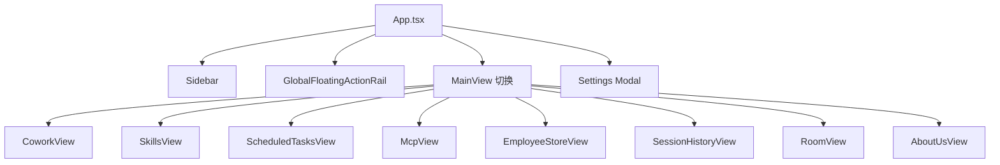
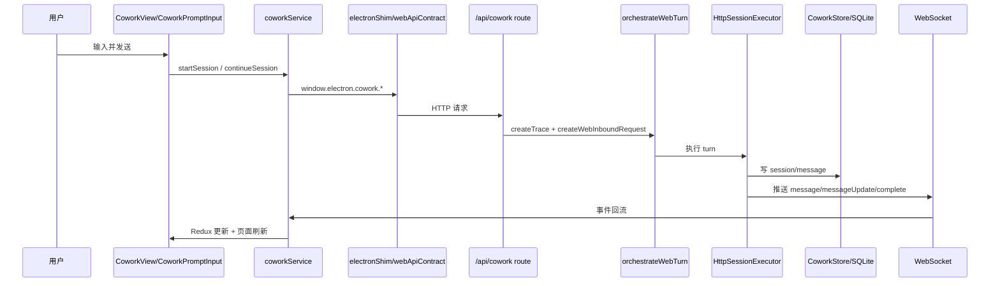
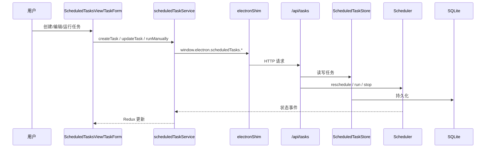
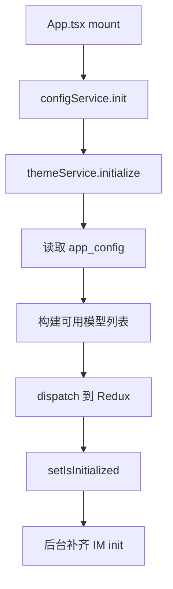

# 前端复盘 X-Ray：1.0 施工图纸

记录时间：2026-04-04 20:45:00

标签：

- `前端复盘`
- `施工图纸`
- `页面盘点`
- `水电布线`
- `组件复用`
- `API 路由`
- `1.0 修缮`
- `后续接力`

## 这份文档是干什么的

这不是给“重新发明前端”的设计稿。

这是给当前 1.0 做快速修缮、翻新、维护时用的施工图纸。

目标是：

- 先看清房子现在长什么样
- 再看清水电布线怎么走
- 再决定哪里能修、哪里先别动

一句话：

**1.0 先扫清前端残局，2.0 再慢慢迁 UI。**

---

## Layer 0：房子现在有什么房间

这一层先不谈漂亮不漂亮，
只回答：

- 有哪些页面
- 每个页面大概装了什么
- 是通过什么组件拼起来的

### 总入口壳

- 入口：`src/renderer/App.tsx`
- 角色：整个前端房子的总壳
- 负责：
  - 首屏初始化
  - 主视图切换
  - Sidebar 挂载
  - Settings modal 挂载
  - GlobalFloatingActionRail 挂载
  - 各大页面 lazy load

### 当前主页面清单

`App.tsx` 里的 `mainView` 是页面总目录：

- `cowork`
- `skills`
- `scheduledTasks`
- `mcp`
- `employeeStore`
- `resourceShare`
- `freeImageGen`
- `sessionHistory`
- `room`
- `aboutUs`

### 页面与主要组件

| 页面 | 主文件 | 页面作用 | 关键组件 |
|---|---|---|---|
| 主会话页 | `src/renderer/components/cowork/CoworkView.tsx` | 进入对话主链、起新会话、续聊 | `CoworkPromptInput`、`CoworkSessionDetail`、`HomePromptPanel` |
| 会话详情 | `src/renderer/components/cowork/CoworkSessionDetail.tsx` | 消息渲染、工具轨迹、导出、手工压缩、媒体展示 | `CoworkPromptInput`、`CoworkSessionActionMenu`、`CoworkMediaGallery` |
| 对话记录 | `src/renderer/components/cowork/SessionHistoryView.tsx` | 历史会话列表与打开 | 会话列表组件、过滤逻辑 |
| 侧边栏 | `src/renderer/components/Sidebar.tsx` | 全局导航入口 | `SidebarCompactGrid`、`SidebarCompactTile` |
| 设置页 | `src/renderer/components/Settings.tsx` | 总控配置室 | `IMSettings`、各配置分区 |
| 技能页 | `src/renderer/components/skills/SkillsView.tsx` / `SkillsManager.tsx` | 技能列表、绑定、配置 | `SkillsPopover` 等 |
| MCP 页 | `src/renderer/components/mcp/McpView.tsx` / `McpManager.tsx` | MCP 连接器管理 | MCP 列表与编辑 UI |
| 定时任务页 | `src/renderer/components/scheduledTasks/ScheduledTasksView.tsx` | 任务列表、详情、运行历史 | `TaskForm`、`TaskList`、`TaskDetail` |
| Agent 商店 | `src/renderer/components/employeeStore/EmployeeStoreView.tsx` | 伙伴/角色入口 | 商店视图组件 |
| Room | `src/renderer/components/room/RoomView.tsx` | 小家伙们的实验壳/乐园 | Room 视图组件 |
| 关于我们 | `src/renderer/components/about/AboutUsView.tsx` | 小家说明页 | 内容展示组件 |

### 当前页面组织方式

当前页面层大体是：

---

## Layer 1：房子的地基结构

这一层回答：

- 这房子是什么材质
- 地基在哪里
- 不能随便敲哪堵墙

### 前端基础材料

- 语言：`TypeScript`
- 框架：`React 18`
- 状态管理：`Redux Toolkit`
- 构建工具：`Vite`
- 样式体系：
  - Tailwind 工具类为主
  - 叠加项目自定义视觉变量和 class
- 路由方式：
  - **不是 react-router**
  - 而是 `App.tsx` 内部 `mainView` 手动切页

### 当前前端最关键的地基特点

#### 1. 不是传统多路由网站

这里不是：

- URL 驱动路由
- 页面天然分目录自治

而是：

- `App.tsx` 作为大壳
- 通过 `mainView` 决定当前显示哪个主页面

所以很多“页面问题”，
本质上其实是：

- `App.tsx` 的布局问题
- 全局浮层问题
- 壳层级问题

#### 2. 前端还有一层 Electron 兼容壳

- 文件：`src/renderer/services/electronShim.ts`
- 作用：
  - 在 Web 版本里模拟 `window.electron.*`
  - 让旧调用面继续工作

这意味着当前 1.0 不能随便局部拆壳。

如果局部直接改成纯 fetch，
会造成：

- 有些页面走 `window.electron.*`
- 有些页面走 HTTP service

最后调用面分裂。

#### 3. Redux 是前端的总配电箱

- 文件：`src/renderer/store/index.ts`
- slices：
  - `model`
  - `cowork`
  - `skill`
  - `mcp`
  - `quickAction`
  - `scheduledTask`
  - `im`

结论：

- 页面不是各自直接存一套长期状态
- 大部分“跨页面 / 跨区块”的状态，都应优先从 Redux 和 service 链找

---

## Layer 2：水电布线怎么走

这一层是最关键的维护图。

它回答：

- 页面通过哪个 service 拿数据
- service 又走到哪个 route
- route 再怎么落到底层

### 总原则

固定顺序：

1. 页面文件
2. 对应 service
3. `webApiContract.ts`
4. `electronShim.ts`
5. `server/src/index.ts`
6. 对应 `server/routes/*.ts`
7. 底层 store / sqlite

不要只看 JSX 猜后端。

### 页面 → service → route 对照

| 页面域 | 页面层 | service 层 | route 层 |
|---|---|---|---|
| App 壳 | `App.tsx` | `configService` / `themeService` / `apiService` / `imService` / `coworkService` | `store` / `apiConfig` / `app` / `cowork` / IM routes |
| Cowork 主链 | `CoworkView` / `CoworkSessionDetail` / `SessionHistoryView` | `coworkService` | `server/routes/cowork.ts` |
| Settings | `Settings.tsx` | `configService` / `coworkService` / `localStore` / `imService` | `store` / `cowork` / `app` / IM routes |
| Skills | `SkillsView` / `SkillsManager` / `SkillsPopover` | `skillService` | `server/routes/skills.ts` / `skillRoleConfigs.ts` |
| MCP | `McpView` / `McpManager` | `mcpService` | `server/routes/mcp.ts` |
| Scheduled Tasks | `ScheduledTasksView` / `TaskForm` / `TaskList` | `scheduledTaskService` | `server/routes/scheduledTasks.ts` |

### Cowork 主链 SOP

### Scheduled Tasks 主链 SOP

### App 壳初始化 SOP

---

## Layer 3：重点页面怎么写、什么时候触发 API

这一层回答：

- 页面里什么内容是静态壳
- 什么内容会触发 API
- 触发时机是什么

### `App.tsx`

#### 页面内容

- 主壳
- Sidebar
- GlobalFloatingActionRail
- 主内容区
- Settings 覆盖层

#### 触发 API / service 的时机

- `mount` 时：
  - `configService.init()`
  - `themeService.initialize()`
  - `apiService.setConfig(...)`
- 初始化后后台补齐：
  - `imService.init()`
  - `imService.refreshRuntimeStatus('feishu')`

#### 特别说明

`App.tsx` 不是普通外壳，
它同时是：

- 视图切换器
- 布局骨架
- 顶部/侧边全局挂件挂载点

所以侧边栏和容器吸附问题，
首查这里。

### `CoworkView.tsx`

#### 页面内容

- 首页 prompt 面板
- 最新会话提示
- 当前会话详情切换

#### 触发 API / service 的时机

- `mount` 时：
  - `coworkService.init()`
  - 后台 `checkApiConfig()`
- 发送时：
  - `coworkService.startSession()`
  - `coworkService.continueSession()`
- 停止时：
  - `coworkService.stopSession()`

#### 关键点

- 默认不直接让页面自己 fetch
- 会话主链应统一通过 `coworkService`

### `CoworkSessionDetail.tsx`

#### 页面内容

- 用户消息
- 助手消息
- 工具轨迹
- 图片/视频/音频媒体展示
- 导出 / 压缩 / 打断动作

#### 触发 API / service 的时机

- 手工压缩：
  - `coworkService.compressContext(...)`
- 打断进程：
  - `coworkService.stopSession(...)`
- 加载更早历史：
  - `coworkService.loadSession(..., { messageLimit })`

#### 关键点

- 这里是会话体验最重的房间
- 现在正在从“巨型详情页”往“媒体积木 / 动作积木 / 跳转积木”方向拆

### `Settings.tsx`

#### 页面内容

- API / 模型 / 运行配置
- IM 配置
- 记忆设置
- 其他系统配置

#### 触发 API / service 的时机

- 打开后：
  - 读取 store/config/cowork 配置
- 保存时：
  - 写 `app_config`
  - 写 `im_config`
  - 可能触发 env 同步、role runtime 视图同步

#### 关键点

- Settings 不只是前端表单
- 它写的是总控配置室
- 很多配置会继续影响运行时和角色视图

---

## Layer 4：当前前端最值得维护的断点

这一层不是全面重构计划，
而是给 1.0 修缮用的“先修哪里”。

### 1. 布局骨架断点

重点文件：

- `App.tsx`
- `Sidebar.tsx`
- `GlobalFloatingActionRail.tsx`

问题类型：

- 容器内外层级不清
- 左侧栏与右侧挂件容易回到内容容器里
- 大屏 / 中小屏风格容易分裂

### 2. 组件复用断点

重点文件：

- `SidebarCompactGrid.tsx`
- `SidebarCompactTile.tsx`
- `ConversationAction*`
- `CoworkMedia*`

问题类型：

- 已有组件没被复用
- 旧壳没清掉
- 同类按钮长两套语言

### 3. 兼容壳断点

重点文件：

- `electronShim.ts`
- `coworkService.ts`
- `webApiContract.ts`

问题类型：

- 局部绕过兼容壳，容易造成调用面分裂
- 1.0 不适合在这层做“半拆半不拆”

### 4. 真实页面校验断点

重点文件：

- `App.tsx`
- `Sidebar.tsx`
- 真实运行链截图

问题类型：

- 代码看起来对，不代表真实页面对
- 以后必须：
  - 先 build
  - 再跑真实页面
  - 再用截图收口

---

## Layer 5：给 1.0 修缮的操作准则

### 做什么

- 拆小组件
- 统一样式语言
- 统一吸附层挂载位置
- 统一同类交互
- 清掉死分支和孤儿组件

### 暂时不做什么

- 不做大规模 UI 框架迁移
- 不把 2.0 的重构偷渡进 1.0
- 不局部拆掉 Electron 兼容壳
- 不凭普通后台经验擅断这个项目

### 推荐修缮顺序

1. 布局壳
   - `App.tsx`
2. 侧边栏
   - `Sidebar`
   - `SidebarCompactGrid`
   - `SidebarCompactTile`
3. 全局挂件
   - `GlobalFloatingActionRail`
   - `UtilityActionStack`
   - `ConversationJumpWidget`
4. 会话工具与媒体积木
   - `ConversationAction*`
   - `CoworkMedia*`
5. 真实截图校验

---

## 一句话总收束

如果把这个项目前端当成一栋房子：

- `App.tsx` 是总承重墙和房屋骨架
- Redux 是总配电箱
- `electronShim + webApiContract + routes` 是水电布线
- `Cowork / Settings / Skills / MCP / Tasks` 是主要房间
- 当前 1.0 的任务不是重建房子
- 而是先把漏水、乱线、歪门、重复柜子整理好

先修缮，
再迁新家。
