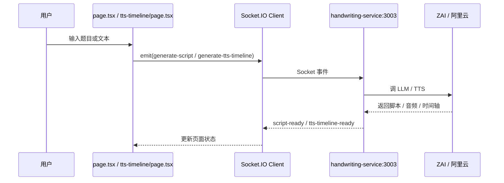
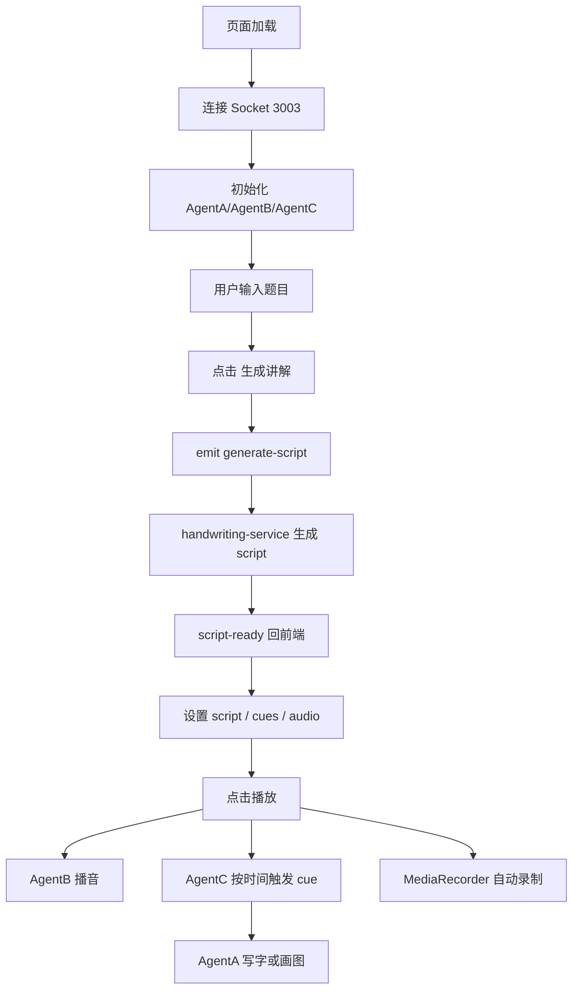
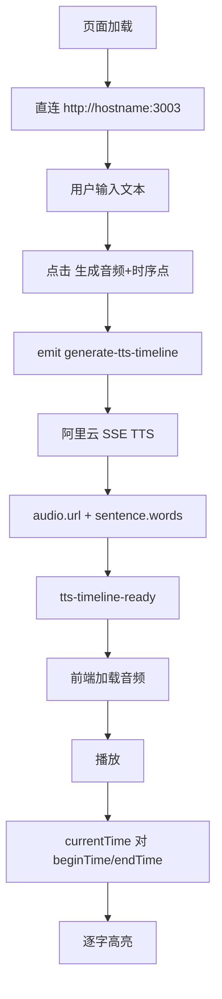

# baiban X-Ray 施工图纸

记录时间：2026-04-05 00:35:00

标签：

- `baiban`
- `X-ray`
- `施工图纸`
- `真相源`
- `前端皮套`
- `Socket 微服务`

## 0. 先说结论

`C:\Users\Administrator\Desktop\baiban` 当前不是一个完整成型产品，
而是：

- 一个 `Next.js 16 + React 19 + shadcn/ui` 的前端皮套
- 一个独立的 `mini-services/handwriting-service` Socket 微服务
- 加上一层还没真正用起来的 `Prisma + SQLite` 地基

现役业务链不是走 HTTP API，
而是走：

```text
前端页面
-> Socket.IO
-> 3003 handwriting-service
-> ZAI / 阿里云 TTS
-> 回前端
```

所以后面继续翻新维护时，
**不要先去 REST route 里找主线**，
先看页面和 `3003` 微服务。

---

## 1. 房子地基结构

### 技术栈（地基材料）

根配置来自：

- `C:\Users\Administrator\Desktop\baiban\package.json`
- `C:\Users\Administrator\Desktop\baiban\tsconfig.json`
- `C:\Users\Administrator\Desktop\baiban\next.config.ts`

当前地基：

- 前端框架：`Next.js 16`
- 运行模式：`App Router`
- 语言：`TypeScript`
- UI：`Tailwind CSS 4 + shadcn/ui + Radix`
- 状态/行为：以页面内 `useState/useRef/useEffect` 为主，没有真正成体系的全局 store
- 数据层：`Prisma + SQLite` 已铺地基，但主业务基本没用上
- 实时交互：`socket.io-client`
- 微服务运行：`bun`

### 现役真相

`next.config.ts` 里明确写了：

- `output: "standalone"`
- `typescript.ignoreBuildErrors = true`
- `reactStrictMode = false`

这意味着：

- 构建能过，不代表类型干净
- 当前项目是“先跑起来”的口径，不是“类型已收干净”的口径

### 已实勘的硬伤

运行 `bunx tsc --noEmit` 后，当前有 4 个真实错误：

1. `examples/websocket/server.ts` 缺 `socket.io`
2. `mini-services/handwriting-service/index.ts` 第 `123` 行 `ZAI.create(config)` 类型不匹配
3. `src/app/page.tsx` 第 `1157` 行 `getAudioElement` 不存在
4. `src/app/page.tsx` 第 `1158` 行 `getAudioElement` 不存在

说明：

- 当前“能跑”和“类型整洁”是两回事

---

## 2. 顶层目录树（4层内口径）

### 现役目录

```text
baiban/
├─ src/
│  ├─ app/
│  │  ├─ page.tsx
│  │  ├─ tts-timeline/page.tsx
│  │  ├─ api/route.ts
│  │  ├─ layout.tsx
│  │  └─ globals.css
│  ├─ components/ui/
│  ├─ hooks/
│  └─ lib/
├─ mini-services/
│  └─ handwriting-service/
├─ prisma/
├─ docs/
├─ examples/
├─ .zscripts/
├─ public/
├─ upload/
├─ download/
└─ db/
```

### 目录角色判断

- `src/app`：前台房间
- `src/components/ui`：家具仓库（几乎全是脚手架组件）
- `src/lib`：少量工具和 DB 入口
- `mini-services/handwriting-service`：现役业务机房
- `prisma`：数据库地基，但目前像“毛坯”
- `examples`：旁边的样板间，不是主房间
- `.zscripts`：实验脚本与启动脚手架
- `docs`：现有文档，但里面有部分口径已经落后于现役代码

---

## 3. 页面盘点（房间）

### 页面 1：大白板主页面

文件：

- `C:\Users\Administrator\Desktop\baiban\src\app\page.tsx`

文件体量：

- `65762` 字节，明显是巨型单页

这页自己干了太多事：

- 手写渲染器
- 音频播放器
- 时间轴导演
- 录屏
- API 配置弹窗
- TTS 时间轴试验区
- 大量 UI 布局

#### 页面内部核心类

页面内部直接定义了 3 个“Agent 类”：

- `AgentA_Writer`
- `AgentB_Speaker`
- `AgentC_Director`

它们都写在一个页面文件里，
说明这里不是组件化页面，
而是“单文件控制台”。

#### 页面主要内容

从真实 JSX 看，这页现在是三栏结构：

- 左：素材预览 + 时间轴
- 中：Canvas 白板
- 右：题目输入 + 控制 + Agent 状态

另外还被塞进了一块 TTS 时间轴预览区。

#### 页面触发点

真实触发函数：

- `handleSaveApiConfig`
- `handleGenerate`
- `handleGenerateTtsTimeline`
- `handleToggleTtsTimelinePlayback`
- `handlePlay`
- `handlePause`
- `handleStop`
- `startRecording`
- `downloadVideo`

#### 页面与后端交互

不是 `fetch`，
而是 Socket：

- `configure-api`
- `generate-script`
- `generate-tts-timeline`

#### 当前判断

这页属于明显的“屎山入口”，
后续维护应该尽量拆：

- TTS 试验台拆出去
- 白板演示主链保留
- Agent 类下沉到独立模块

### 页面 2：最小 TTS 时间轴试验台

文件：

- `C:\Users\Administrator\Desktop\baiban\src\app\tts-timeline\page.tsx`

这是当前最干净、最适合继续试验的房间。

它只做：

- 文本输入
- 语音角色
- 输出格式
- 生成音频 + 时序点
- 播放 / 重置
- 音频 URL
- 逐字高亮
- JSON 复制

这页已经改成直连：

- `http://<hostname>:3003`

比主页面里旧的 `/?XTransformPort=3003` 更贴近当前本地真实环境。

### 页面 3：HTTP API 测试页

文件：

- `C:\Users\Administrator\Desktop\baiban\src\app\api\route.ts`

真实内容只有：

```ts
GET => { message: "Hello, world!" }
```

说明：

- 这不是业务主链
- 只是脚手架残留路由

---

## 4. 水电布线（API / 路由 / 交互链）

### 4.1 真主链不是 REST，是 Socket

当前前后端主链：



### 4.2 大白板页面的 SOP



### 4.3 最小 TTS 页面 SOP



---

## 5. 核心微服务（中继器 / 开关控制器）

### 文件

- `C:\Users\Administrator\Desktop\baiban\mini-services\handwriting-service\index.ts`

### 它在做什么

这是当前项目的业务中台。

它负责：

- 维护 Socket 服务
- 保存按 socket 分配的 API 配置
- 调 `ZAI` 做脚本生成
- 调阿里云 CosyVoice SSE 做 TTS 时间轴
- 把结果推回前端

### 现役事件

真实可见的 socket 事件：

- `configure-api`
- `generate-script`
- `generate-tts-timeline`
- `play`
- `pause`
- `stop`

返回事件：

- `api-configured`
- `status`
- `script-ready`
- `tts-timeline-ready`
- `tts-timeline-error`
- `playing`
- `paused`
- `stopped`
- `error`

### 它的两条业务链

#### 链 1：旧链 `generate-script`

依赖：

- `ZAI_API_KEY`
- `ZAI_BASE_URL`

功能：

- 让 LLM 输出 `segments`
- 拼成完整讲解文本
- 再用 `zai.audio.tts.create` 生成 base64 音频
- 估算 cue 时间并回给前端

风险：

- 时间分配是估算，不是真 TTS 时间轴
- 仍有类型错误：`ZAI.create(config)` 不匹配 SDK 当前声明

#### 链 2：现役新链 `generate-tts-timeline`

依赖：

- `DASHSCOPE_API_KEY`

功能：

- 调阿里云 `SpeechSynthesizer`
- 开启 `X-DashScope-SSE`
- 聚合 `audio.url`
- 聚合 `sentence.words[].begin_time/end_time`

当前这条链已经过真实冒烟。

---

## 6. 环境信息（真正需要的钥匙）

从真实代码扫描到的环境变量：

- `DASHSCOPE_API_KEY`
- `ZAI_API_KEY`
- `ZAI_BASE_URL`
- `DATABASE_URL`

### 作用分层

- `DASHSCOPE_API_KEY`
  - 给阿里云 TTS 时间轴链
- `ZAI_API_KEY` / `ZAI_BASE_URL`
  - 给旧 `generate-script`
- `DATABASE_URL`
  - 给 Prisma SQLite

### 当前真实状态

- `mini-services/handwriting-service/.env` 已存在
- 这说明微服务环境配置已经开始脱离前端页面手填

但前端大页面里仍保留：

- API Key 弹窗
- `configure-api`

这意味着当前项目有两套配置口径并存：

1. 页面内临时配置
2. 微服务本地 `.env`

这是后续必须收口的地方。

---

## 7. 可复用资源初筛

### 可以直接复用

- `src/components/ui/*`
  - 基本是 shadcn/ui 全家桶
- `src/lib/tts-timeline.ts`
  - 已整理出时间轴类型、归一化、扁平化和高亮索引
- `mini-services/handwriting-service/index.ts`
  - 已有现成 Socket 服务和阿里云 TTS 逻辑
- `.zscripts/aliyun_tts_timeline_probe.py`
  - 作为探针脚本有价值

### 谨慎复用

- `src/app/page.tsx`
  - 体量过大，适合拆，不适合继续堆
- `examples/websocket/*`
  - 只是样板，不是主链

### 当前基本没用上的资源

- `Prisma + db.ts + schema.prisma`
  - 目前更像脚手架遗留地基
- `src/app/api/route.ts`
  - 只有 hello world

---

## 8. 明显问题记录（不是猜的）

### 8.1 构建脚本跨平台有坑

根 `package.json` 的 `build` 使用：

- `cp -r`

这在 PowerShell 下会失败，
当前要靠 Git Bash 才能顺利跑通。

### 8.2 根 README 明显过时

`README.md` 还是标准 `Z.ai Code Scaffold` 文案，
和当前白板、Socket、TTS 主链不一致。

说明：

- 文档真相源不能优先信 README

### 8.3 metadata 仍是脚手架品牌

`src/app/layout.tsx` 里的 metadata 仍是：

- `Z.ai Code Scaffold`
- `chat.z.ai`

这和当前项目身份不一致。

### 8.4 主页面 Socket 口径和最小页不一致

大页：

- `io('/?XTransformPort=3003')`

最小页：

- `io(http://hostname:3003)`

说明：

- 当前存在双口径
- 代理环境和本地环境没有统一

### 8.5 大页文件职责混杂

`src/app/page.tsx` 里同时放了：

- Agent 类
- Canvas 绘制
- Socket
- 录屏
- TTS 试验
- 大量 UI

这是明显病灶点。

### 8.6 类型检查被静默放过

`next.config.ts` 里忽略 TS build error，
意味着：

- 页面能开 ≠ 代码已稳

---

## 9. 对项目的真实定位

这个项目现在更像：

```text
一个白板/教学视频沙箱
而不是完整的生产系统
```

它已经具备：

- 前端试验台
- 音频生成
- 字级时间轴
- 手写/Canvas 演示雏形
- 自动录屏雏形

但还没有真正收成：

- 清晰的模块边界
- 稳定的配置口径
- 干净的 API 层
- 一致的构建/类型基线

---

## 10. 后续翻新顺序建议

### 第一阶段：先守现役小闭环

1. 以 `/tts-timeline` 为最小可用主线
2. 固定 `text -> audio.url + word_timeline`
3. 不先碰 MP4

### 第二阶段：拆大页

1. 把 `AgentA/AgentB/AgentC` 拆文件
2. 把录屏逻辑拆文件
3. 把 TTS 试验逻辑完全从大页移走

### 第三阶段：统一水电

1. 统一 Socket 连接口径
2. 统一环境配置口径
3. 决定 Prisma 是真用还是先冻住

### 第四阶段：板书轨接入

1. 保留 TTS 朗读轨
2. 单独建立板书轨
3. 做“字幕逻辑 -> 手写逻辑”的映射

---

## 一句话总收束

`baiban` 当前最真实的形态不是“成熟产品”，
而是：

**一个以 Next 前端皮套 + 3003 Socket 微服务为核心的白板/TTS 实验工地。**

以后继续做，
先看：

- `src/app/page.tsx`
- `src/app/tts-timeline/page.tsx`
- `mini-services/handwriting-service/index.ts`

别先被 README、空 API、Prisma 脚手架带偏。
