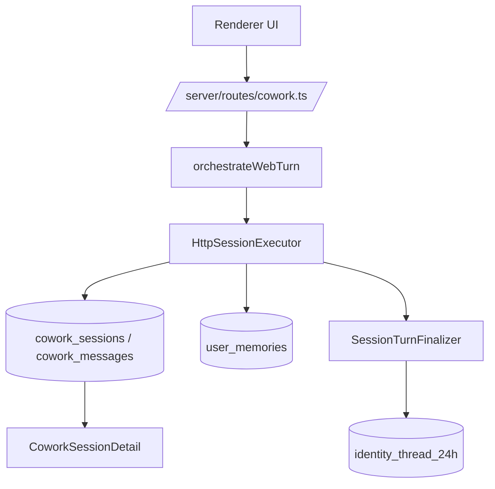

# 连续性主链埋点图（2026-03-30）

> 用途：把当前仓库里“身份连续性 / 广播板接力 / 记忆写入 / UI 展示”的主干链路钉死，作为后续修缮锚点。
>
> 原则：这份文档只标当前现役链路和关键失真边界，不讨论理想态，不把历史兼容壳误判为主路。

## 1. 主链总览

## 2. 分层说明

### A. 真相源层

- `cowork_sessions`
  - 会话主表
- `cowork_messages`
  - 原始对话真相源
- `identity_thread_24h`
  - 24h 热缓存交接板
- `user_memories`
  - 规则化、事件化、可沉淀记忆

### B. 执行层

- `server/routes/cowork.ts`
  - Web 新建/续聊入口
- `clean-room/spine/modules/sessionOrchestrator.ts`
  - 当前 Web 会话编排主路
- `server/libs/httpSessionExecutor.ts`
  - 当前现役轻执行器
- `server/libs/sessionTurnFinalizer.ts`
  - 回合结束后的共享线程写入收尾

### C. 展示层

- `src/renderer/components/cowork/CoworkView.tsx`
  - 页面级进入、启动、续聊
- `src/renderer/components/cowork/CoworkSessionDetail.tsx`
  - 会话详情展示、折叠、导出

## 3. 埋点清单

| 层 | 符号 | ID | 文件 | 说明 |
|---|---|---|---|---|
| route | `⚡` | `continuity-route-start-001` | `server/routes/cowork.ts` | Web 新建会话入口 |
| route | `⚡` | `continuity-route-continue-001` | `server/routes/cowork.ts` | Web 续聊入口 |
| executor | `💾` | `continuity-executor-message-write-001` | `server/libs/httpSessionExecutor.ts` | user/assistant 消息写入 `cowork_messages` |
| executor | `📦` | `continuity-system-prompt-assembly-001` | `server/libs/httpSessionExecutor.ts` | 连续性 prompt 拼装 |
| finalizer | `💾` | `continuity-shared-thread-finalize-001` | `server/libs/sessionTurnFinalizer.ts` | 本轮新增消息写入共享线程 |
| thread | `📦` | `continuity-thread-summary-001` | `server/libs/identityThreadHelper.ts` | 共享线程摘要压缩与锚点生成 |
| memory | `💾` | `continuity-memory-write-001` | `user_memories` 相关链路 | 长短期记忆沉淀 |
| ui | `🔌` | `continuity-ui-start-001` | `src/renderer/components/cowork/CoworkView.tsx` | 首页启动会话 |
| ui | `🔌` | `continuity-ui-continue-001` | `src/renderer/components/cowork/CoworkView.tsx` | 会话详情续聊 |
| ui | `⚠️` | `continuity-ui-display-boundary-001` | `src/renderer/components/cowork/CoworkSessionDetail.tsx` | 展示折叠不能反向污染真相源 |

## 4. 关键边界

### 4.1 哪些属于“真相”，不能乱压

- `cowork_messages` 里的原始消息
- `user_memories` 里的记忆条目
- `identity_thread_24h` 里的交接摘要
- 执行器产生的真实 assistant 输出序列

### 4.2 哪些可以只做展示降噪

- thinking 折叠
- tool result 卡片折叠
- markdown 导出过滤
- UI 分组后的 assistant turn

规则：

- 展示层可以折叠
- 但不能把折叠结果反写成真相源
- 导出层如果做过滤，必须明确标注它是 display/export policy，不是真相定义

## 5. 当前需要盯紧的失真点

### 失真点 1：共享线程是摘要，不是全文

文件：

- `server/libs/identityThreadHelper.ts`

说明：

- 这里本来就设计成“广播板 / 交接板”
- 合理，但必须始终保留“定位原文锚点”的语义
- 不能让下游把它当成完整上下文全文

### 失真点 2：UI 导出和渲染有过滤

文件：

- `src/renderer/components/cowork/CoworkSessionDetail.tsx`

说明：

- 这里可以做 display-only 去噪
- 但不能作为记忆抽取真相源

### 失真点 3：旧兼容壳仍可能压扁输出

文件：

- `src/main/libs/coworkRunner.ts`

说明：

- Web 主链已不是它
- 但历史兼容壳仍可能在其他入口里把多段输出合并、截断、覆盖
- 修缮时需要把它和现役主链分开看

## 6. 排查顺序

后续修缮时按这个顺序排：

1. `route` 是否走对执行器
2. `executor` 是否保留真实消息序列
3. `finalizer` 是否把本轮新增消息正确写进共享线程
4. `identity_thread_24h` 是否只做摘要且保留锚点
5. `user_memories` 是否基于真实对话抽取
6. `UI/export` 是否只是显示策略，而不反向污染真相

## 7. 结论

当前仓库的连续性主链不是空的，也不是完全丢了。

更准确的判断是：

- 主干仍在
- 语义仍在
- 但执行链和展示链之间已经出现“压缩 / 失真 / RPA 化”风险

所以后续工作不是“重做一套新的”，而是：

- 以这份埋点图为锚点
- 逐段修缮
- 恢复连续性
- 恢复接力感
- 避免再次把 agent 压成只会跑流程的壳
