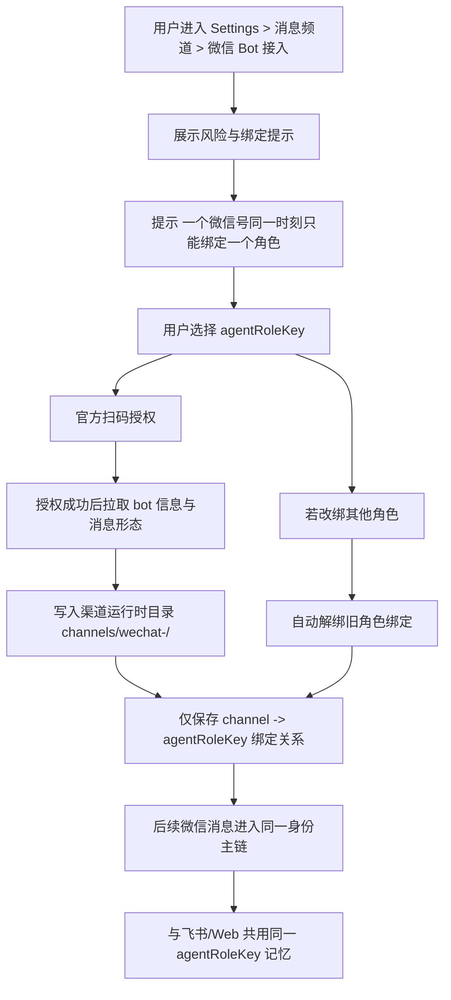

# 2026-03-28 Settings / IM / 微信 Bot 现实勘察与设计约束

## 目的

这份文档只记录两类内容：

1. 已经读代码确认过的现实。
2. 当前 owner 明确钉死的微信 Bot 设计约束。

不把猜测写成事实，不把旧项目经验当成当前仓库现实。

---

## 已确认现实

### 1. 环境与运行目录边界

- 运行目录默认收口到项目内 `./.uclaw/web`。
- 运行路径解析不依赖固定盘符；`src/shared/runtimeDataPaths.ts` 会优先找项目根，并拒绝项目根之外的 runtime path。
- 设置页展示的 `workspacePath / envSyncTargetPath` 来自：
  - 前端 `src/renderer/services/electronShim.ts`
  - 后端 `server/routes/app.ts`

这意味着后续微信接入不能把 secret、扫码状态、bot 缓存写死到某台机器的固定目录。

### 2. Settings 不是单纯设置表单，而是控制台

- `src/renderer/components/Settings.tsx` 当前 tab 包括：
  - `model`
  - `nativeCapabilities`
  - `clawApi`
  - `im`
  - `conversationCache`
  - `coworkMemory`
  - `resources`
  - `dataBackup`
- `general` 类型仍残留，但默认入口已被 `normalizeSettingsTab()` 收口到 `clawApi`。
- `im` 页不是普通保存表单，而是内嵌子控制台 `IMSettings`。
- `activeTab === 'im'` 时，底部不会出现外层保存按钮，字段按失焦或即时动作保存。

### 3. Settings 的真实读写链

读链：

- `Settings.tsx` -> `configService.init()` -> `configService.getConfig()`
- 运行路径信息额外走 `window.electron.appInfo.getRuntimePaths()` -> `/api/app/runtimePaths`

写链：

- `Settings.tsx` `handleSubmit`
- `configService.updateConfig(...)`
- `localStore.setItem('app_config', ...)`
- `window.electron.store.set(...)`
- `/api/store/app_config`
- `prepareAppConfigForStore(...)`
- `syncAppConfigToEnv(...)`
- `syncRoleCapabilitySnapshots(...)`

结论：

- `app_config` 不是轻 KV。
- 它会联动 `.env` 与角色运行态快照。

### 4. IM 页的真实读写链

- 前端 `src/renderer/services/im.ts` 明确写了：IM 当前不是完全走 `window.electron` 兼容壳，而是“本地存储 + 直连飞书 gateway”的混合链。
- `im_config` 保存最终仍落到 `/api/store/im_config`。
- 后端 `server/routes/store.ts` 对 `im_config` 写入会触发：
  - `syncImConfigToEnv(...)`
  - `syncImaConfigToRoleSecrets(...)`
  - `ensureImaSkillBindings(...)`

结论：

- `im_config` 也不是轻 KV。
- IMA 凭证会被同步到 shared secret 和角色 secret。

### 5. 飞书是活链，企业微信不是

飞书：

- 后端存在真实 gateway 路由：
  - `GET /api/im/feishu/gateway/status`
  - `POST /api/im/feishu/gateway/start`
  - `POST /api/im/feishu/gateway/stop`
- 启动时强制要求 `agentRoleKey`，不是只存 appId/appSecret。

企业微信 / `wecom`：

- 前端有类型、表单、联通检查壳、启停壳。
- 但 2026-03-28 对当前仓库 `server/` 的全量搜索，没有找到 `wecom` 的后端路由或运行执行链。

当前判断：

- `wecom` 现在是前端配置壳，不应当被当作“已实现的微信官方接入”。

### 6. 当前仓库里已有两个“微信相关”概念，但不是一回事

`wecom`

- 位置：IM 平台可见项。
- 形态：企业微信配置壳。
- 当前未确认有后端运行链。

`ima`

- 位置：IMSettings 左侧“微信拓展”区块。
- 形态：凭证保管桶，不是消息渠道。
- 文案已经明确写出：
  - 这里只统一保管 IMA 凭证
  - 给哪个角色使用，去 Skills 安装 `ima-note`
  - 后续微信插件扫码授权之类的特例，也继续收口到这里

这说明：

- 如果后面要做“微信 Bot 接入”，现有 UI 里最自然的落点不是硬塞进飞书，也不是直接把 `wecom` 当成已可运行链。
- 更合理的方向，是把“微信官方扫码授权类特例”继续收口到 IM 中的微信扩展区域，再决定是否独立成新的微信项。

---

## Owner 新增硬约束

以下是本轮新增且必须进设计稿的规则：

### 0. 微信产品线必须严格拆开

owner 已明确区分 3 个不同概念：

- `ima`
  - 是知识库 / 微信生态扩展能力
  - 不是个人微信消息入口
  - 当前仓库里对应 `ima-note` 能力与 IMA 凭证托管
- `wecom`
  - 是企业微信
  - 不是个人微信
  - 当前仓库里只有前端配置壳，未确认后端活链
- `wechatbot`
  - 是个人微信 Bot
  - 这是当前要做的目标方向
  - 不能被等同为 `ima`
  - 也不能被等同为 `wecom`

后续文档、变量命名、页面文案、接口命名，都必须避免把这三者混写成一个“微信”。

### 1. 单微信号只能绑定一个角色

用户侧必须明确提示：

- 一个微信号同一时刻只能绑定一个角色身份。
- 绑定前必须让用户显式确认要绑定哪个角色。
- UI 形式建议使用下拉选择或勾选确认，不能默认偷偷绑定。

### 2. 微信对话与飞书对话共享同一身份记忆

用户侧必须明确提示：

- 只要绑定到同一个 `agentRoleKey`，微信对话与飞书对话会共享同一套身份记忆与连续性。
- 用户无需担心“换了渠道就不记得了”。

这与仓库当前身份铁律一致：

- 连续性按 `agentRoleKey`
- 不按 `modelId`
- 不按渠道

### 3. 换绑角色时，旧角色自动解绑

用户侧必须明确提示：

- 如果要把同一微信号改绑到另一个角色，需要在设置页重新选择绑定角色。
- 新绑定生效后，旧角色绑定自动解除。
- 不允许一个微信号同时挂在多个角色下面。

---

## 推荐插入位

当前推荐，不是最终实现承诺：

### 推荐方案

把“微信 Bot 接入”放在：

- `Settings`
- `im`
- “微信扩展”分区内新增独立的 `个人微信 WechatBot` 入口

原因：

1. 这里已经是“消息渠道 / 微信扩展 / 特殊凭证”的收口位。
2. 现有文案已经为“扫码授权特例”留了口。
3. 可以避免把 `ima`、`wecom`、`wechatbot` 三条线混在一起。
4. 可以避免把没有后端链的 `wecom` 壳误当成真入口。

### 不推荐直接复用当前 `wecom` 壳

原因：

1. 当前 `wecom` 只有前端配置表单现实。
2. 没有确认后的后端 gateway / webhook / runtime secret / bot metadata 链。
3. 直接复用容易把“企业微信表单”误演成“微信官方 Bot 接入”，认知会错。

---

## 当前链路图

```mermaid
flowchart TD
  A[Settings.tsx] --> B[configService.init / getConfig]
  B --> C[localStore]
  C --> D[window.electron.store]
  D --> E[/api/store/app_config]
  E --> F[prepareAppConfigForStore]
  F --> G[syncAppConfigToEnv]
  F --> H[syncRoleCapabilitySnapshots]

  A --> I[IMSettings]
  I --> J[imService.updateConfig]
  J --> C2[localStore im_config]
  C2 --> D2[window.electron.store]
  D2 --> E2[/api/store/im_config]
  E2 --> F2[syncImConfigToEnv]
  E2 --> G2[syncImaConfigToRoleSecrets]
  E2 --> H2[ensureImaSkillBindings]

  I --> K[/api/im/feishu/gateway/*]
```

---

## 官方 `@tencent-weixin/openclaw-weixin@1.0.2` 解剖结果

### 1. 本地现状

已确认本机曾拉取官方包，但尚未接入当前仓库依赖：

- `D:\Users\Admin\Desktop\3-main\.tmp-openclaw-weixin-install\tencent-weixin-openclaw-weixin-1.0.2.tgz`
- `D:\Users\Admin\Desktop\3-main\.tmp-openclaw-weixin-install\tencent-weixin-openclaw-weixin-cli-1.0.2.tgz`

当前仓库 `package.json / package-lock.json / node_modules` 中未发现已安装痕迹。

### 2. 它不是普通 SDK，而是 OpenClaw 插件

主入口 `index.ts` 已确认：

- 依赖 `openclaw/plugin-sdk`
- 调用 `api.registerChannel(...)`
- 调用 `api.registerCli(...)`
- 需要 `api.runtime`

结论：

- 这不是可以直接 `import` 到当前 Express 主线就马上跑起来的普通 npm 库。
- 它默认面向的是 OpenClaw 插件宿主。

### 3. 扫码登录链

扫码开始：

- `GET ilink/bot/get_bot_qrcode?bot_type=3`

扫码等待：

- `GET ilink/bot/get_qrcode_status?qrcode=...`

扫码确认成功后，官方包能拿到：

- `bot_token`
- `ilink_bot_id`
- `ilink_user_id`
- `baseurl`

其中：

- `ilink_bot_id` 会被当作账号 ID
- `ilink_user_id` 是扫码授权的人
- `baseurl` 会随账号一起保存

### 4. 登录后本地状态存储

官方包默认状态目录：

- `OPENCLAW_STATE_DIR`
- 否则 `~/.openclaw`

微信插件自己的目录结构：

- `openclaw-weixin/accounts.json`
- `openclaw-weixin/accounts/<accountId>.json`
- `openclaw-weixin/accounts/<accountId>.sync.json`

账号文件里会保存：

- `token`
- `baseUrl`
- `userId`

### 5. 配对 / 允许使用人

官方包还维护了一层 framework `allowFrom`：

- 路径：`credentials/openclaw-weixin-<accountId>-allowFrom.json`

它会把扫码登录拿到的 `ilink_user_id` 写入允许列表。

这说明：

- 官方默认把“谁有权通过这个微信 bot 发命令”独立建模了。
- 这层与“bot 绑定哪个角色”是两回事，后续我们不能混写。

### 6. 消息与媒体能力面

官方协议已确认支持：

- 文本
- 图片
- 语音
- 文件
- 视频

官方消息 item type：

- `1 TEXT`
- `2 IMAGE`
- `3 VOICE`
- `4 FILE`
- `5 VIDEO`

补充确认：

- 语音下载后优先尝试 `silk-wasm` 转 WAV
- 转码失败时仍可保留原始 SILK
- 下行发送媒体时会自动区分 image / video / generic file
- 还支持 typing ticket / `sendtyping`

### 7. 长轮询主链

官方主收消息链：

- `getupdates`
- `context_token` 缓存在内存
- 回复时必须带回对应 `context_token`

官方主发消息链：

- `sendmessage`
- 媒体先 `getuploadurl`
- 再走 CDN 上传

这意味着：

- 如果我们接官方链，不能只拿到 token 就结束。
- 还必须处理 `context_token`、`get_updates_buf`、CDN 上传、媒体解密/转码。

### 8. 对当前仓库的直接结论

已确认：

- 官方包能力面很强，特别是扫码、语音、媒体链确实比我们自己从零拼更稳。
- 但它当前不是“前端扫完码，给我们一个简单 bot id”的轻组件。
- 它本质是一个完整渠道插件。

因此当前最小可行接入方向有两个：

1. `sidecar / plugin-host` 方向
   - 把官方插件放在独立 OpenClaw 宿主里跑
   - 我们当前仓库只做设置页、绑定关系、状态展示、角色映射

2. `协议移植 / 轻适配` 方向
   - 不直接运行插件宿主
   - 借用官方包里已公开的协议、扫码、轮询、媒体处理逻辑
   - 在当前 `server/` 主线中重建 wechatbot channel

当前更推荐先做第 2 方向的现实核查，再决定是否需要 sidecar。

原因：

- 当前仓库主线并不是 OpenClaw 插件宿主
- 强行直接嵌入插件，结构边界会错
- 但官方包里的扫码协议、媒体协议、状态持久化设计可以直接借鉴甚至部分复用

---

## 未来微信 Bot 接入的约束流程

注意：下面是设计约束，不代表代码已存在。



---

## 当前结论

1. 现在可以确定，`Settings / IM` 已经是微信 Bot 最合适的产品入口层。
2. 当前目标应明确命名为“个人微信 WechatBot”，不能写成含糊的“微信”。
3. 现在不能把当前 `wecom` 壳误判为微信官方 Bot 已有实现，也不能把 `ima` 凭证桶误判为个人微信消息接入。
4. 后续真正实现时，应沿用现有身份铁律：
   - 渠道只保存 `channel -> agentRoleKey`
   - 记忆按 `agentRoleKey` 共享
   - 换绑即解绑旧角色
5. 用户提示文案必须把“单号单角色绑定”和“跨渠道共享记忆”说清楚。

---

## 仍未验证

以下内容当前还没进入代码确认阶段：

- 当前仓库若不引入 OpenClaw 宿主，官方包内部哪些模块能被稳定单独复用
- `bot info` 页面应展示哪些字段
  - 当前扫码登录立刻能确认的字段只有 `ilink_bot_id / ilink_user_id / baseurl`
  - 尚未确认是否能直接拿到更友好的 bot 名称
- 消息类型能力面是否包含语音、图片、文件、群聊事件
- 后端应走 webhook、长连接、官方 SDK 还是独立 sidecar

这些等回到“微信这个东西”实现阶段，再单独核实，不在本文件里臆断。
