# 智能手写教学白板系统 - 技术方案文档 (Mermaid版)

> 本文档使用 Mermaid 图表语法，适合在 GitHub、GitLab、Typora 等支持 Mermaid 的平台查看

## 一、项目概述

### 1.1 项目背景
传统教学视频制作需要教师手动录制板书讲解，存在以下痛点：
- 录制成本高：需要专业设备和后期剪辑
- 内容固化：已录制视频难以修改
- 个性化不足：无法根据学生需求调整讲解方式
- 效率低下：一道题需要反复录制多遍

### 1.2 解决方案
开发一套**智能手写教学白板系统**，通过AI自动生成解题步骤和讲解语音，Canvas实现逐笔手写动画，语音和板书实时同步播放。

---

## 二、系统架构

### 2.1 整体架构图

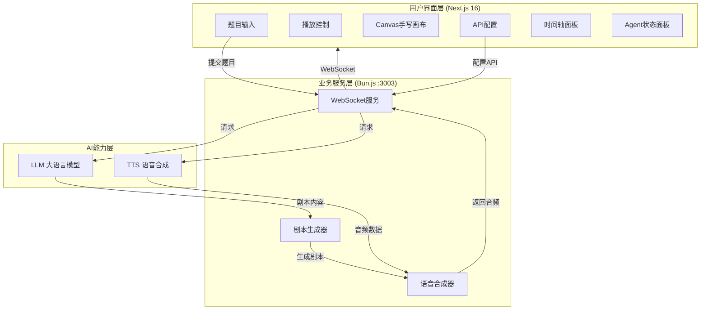

### 2.2 技术栈选型

| 层级 | 技术选型 | 选型理由 |
|------|----------|----------|
| 前端框架 | Next.js 16 + React 19 | 企业级框架，支持SSR，生态完善 |
| UI组件库 | shadcn/ui + Tailwind CSS | 高度可定制，现代化设计 |
| 后端运行时 | Bun.js | 高性能，原生支持TypeScript |
| 实时通信 | Socket.io | 成熟的WebSocket方案，自动重连 |
| AI SDK | z-ai-web-dev-sdk | 统一的AI能力接入，支持LLM+TTS |
| 绘图引擎 | Canvas 2D API | 原生支持，性能优秀，可控性强 |

---

## 三、核心设计

### 3.1 三Agent协作模型

本系统的核心创新点在于**三Agent协作模型**，模拟真实教学场景中的三个角色：

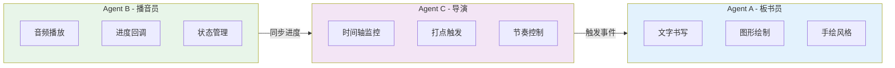

**Agent职责说明：**

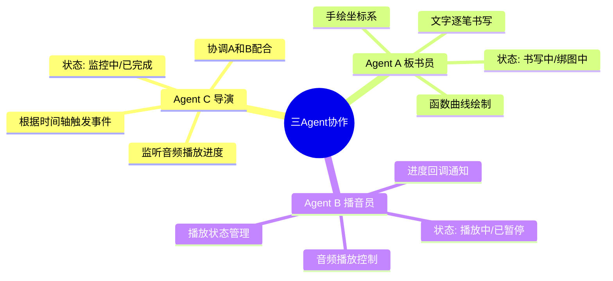

**设计理由：**
1. **关注点分离**：每个Agent只负责一件事，便于维护和扩展
2. **状态可观测**：各Agent状态独立，便于调试和展示
3. **灵活协作**：通过事件驱动，可实现复杂的协作逻辑

### 3.2 时间轴同步方案

**核心挑战**：如何让板书和语音同步？

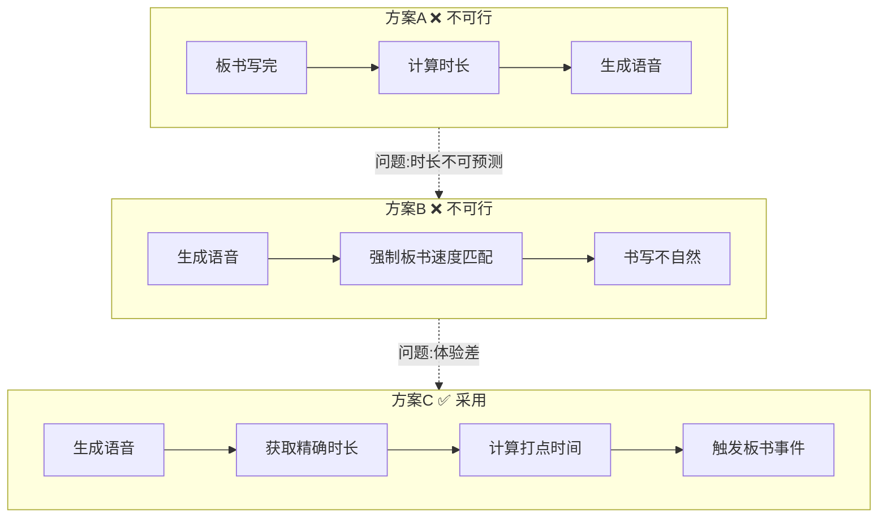

**实现原理**：

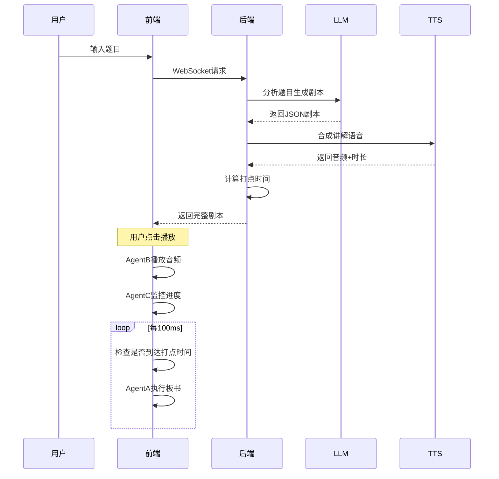

**同步原则**：
> **"大差不差，内容对应即可"** —— 不强求精确对齐，保证内容逻辑正确即可

### 3.3 分题型处理策略

系统自动识别题目类型，采用不同的渲染策略：

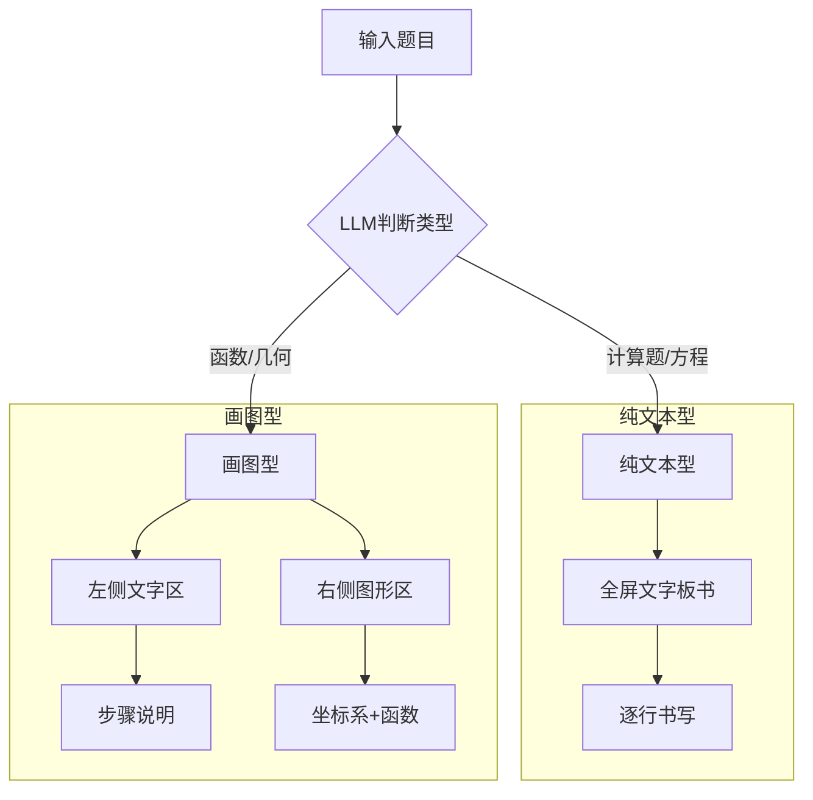

**布局示意**：

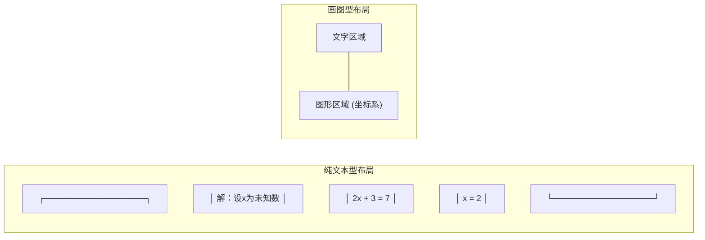

### 3.4 手绘风格实现

**设计目标**：让板书看起来像真人手写，而非机械打印。

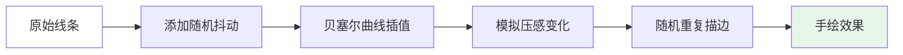

**实现技术**：
1. **线条抖动**：随机偏移使线条不完美
2. **重复描边**：模拟手写时的重复描画
3. **压感模拟**：笔画粗细随位置变化
4. **自然曲线**：使用贝塞尔曲线插值

---

## 四、核心功能模块

### 4.1 剧本生成模块

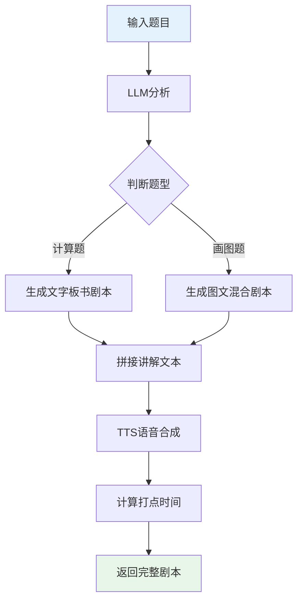

### 4.2 实时同步播放模块

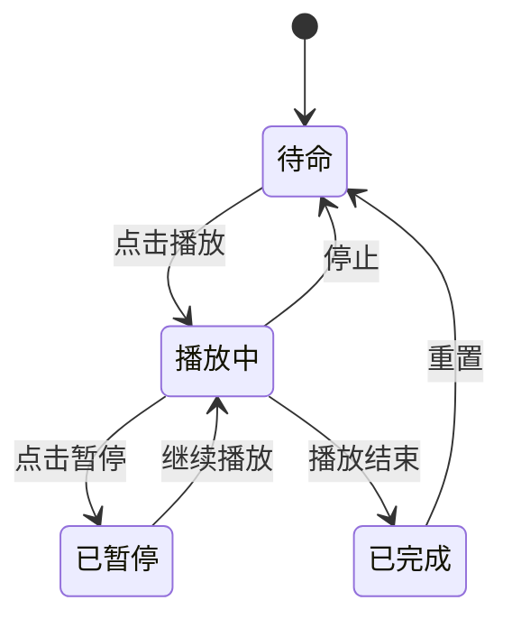

### 4.3 Agent状态流转

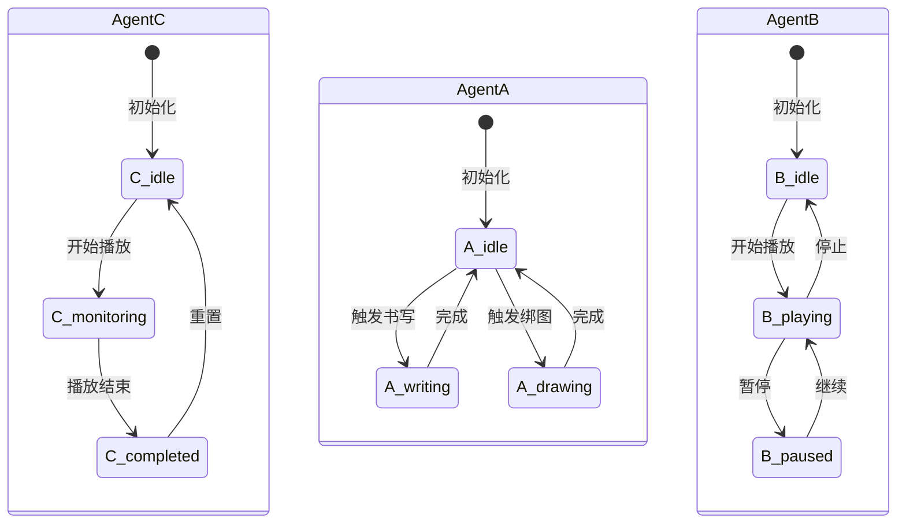

### 4.4 视频录制模块

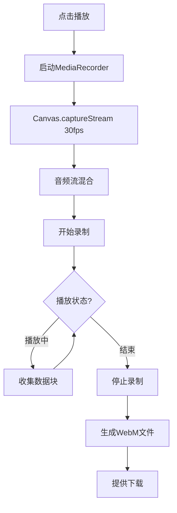

---

## 五、API配置方案

### 5.1 配置流程

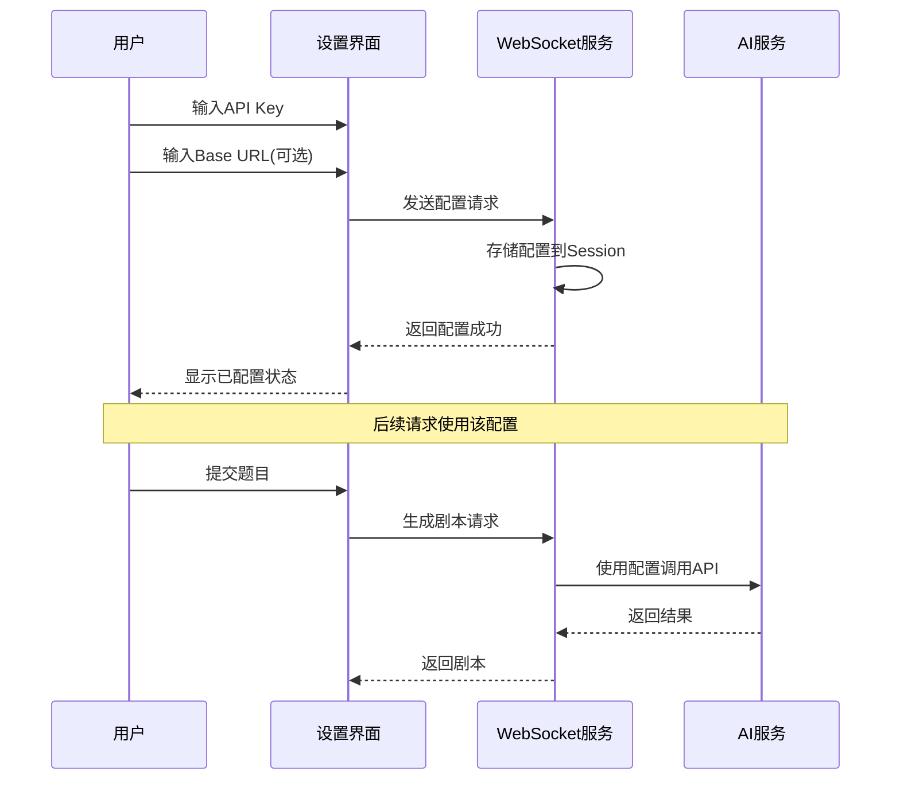

### 5.2 支持的配置项

| 配置项 | 必填 | 说明 |
|--------|------|------|
| API Key | 是 | AI服务认证密钥 |
| Base URL | 否 | 自定义API地址，默认使用官方地址 |

---

## 六、数据流架构

### 6.1 完整数据流

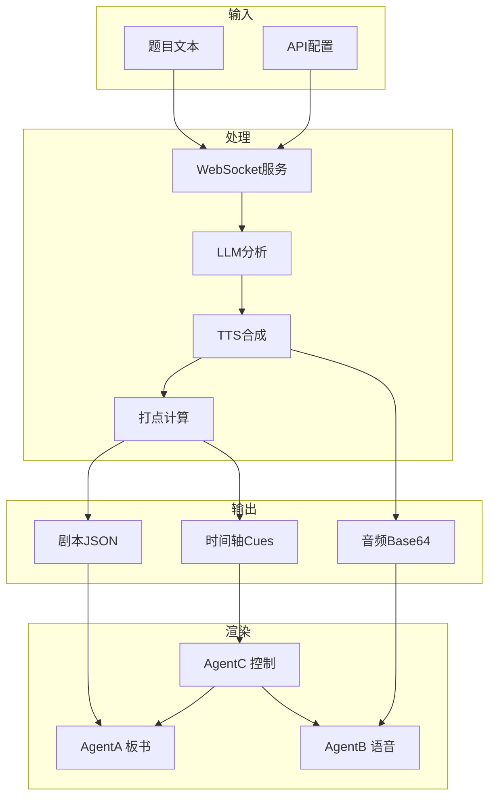

---

## 七、性能优化策略

### 7.1 前端优化

| 优化点 | 方案 | 效果 |
|--------|------|------|
| Canvas渲染 | 使用requestAnimationFrame | 流畅60fps |
| 状态管理 | useRef避免重渲染 | 减少不必要的更新 |
| 音频处理 | 预加载 + 缓存 | 即时播放响应 |
| 录制优化 | 分片收集(100ms) | 内存可控 |

### 7.2 网络优化

| 优化点 | 方案 | 效果 |
|--------|------|------|
| WebSocket | 自动重连机制 | 断线自动恢复 |
| 数据传输 | Base64编码 | 兼容性好 |
| 音频格式 | WAV格式 | 无需转码 |

---

## 八、扩展性设计

### 8.1 题型扩展

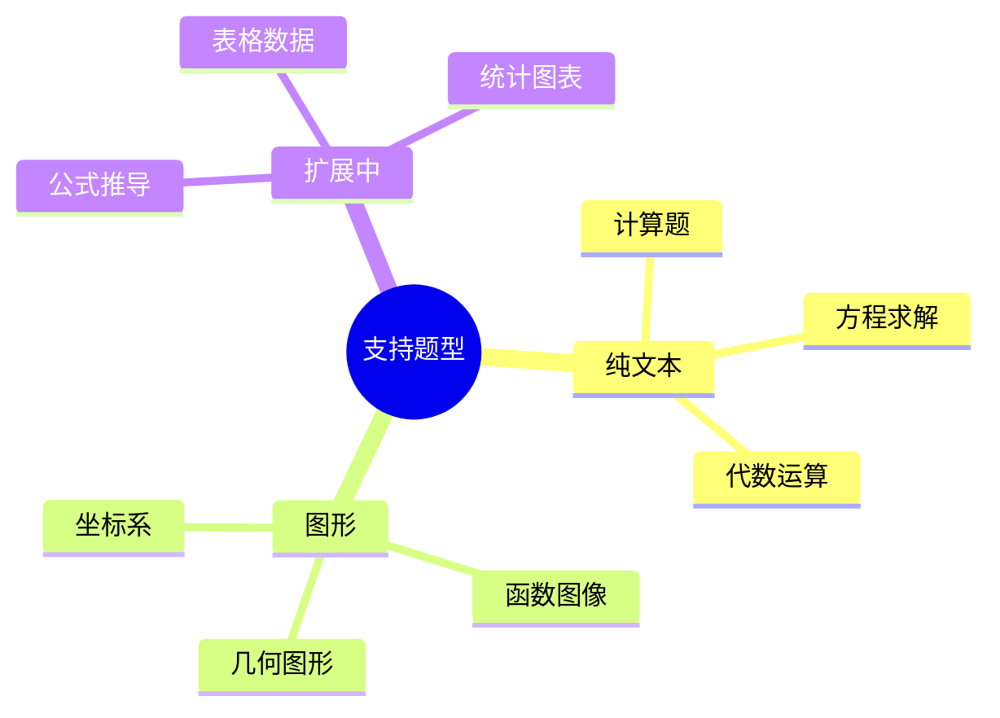

### 8.2 多学科支持

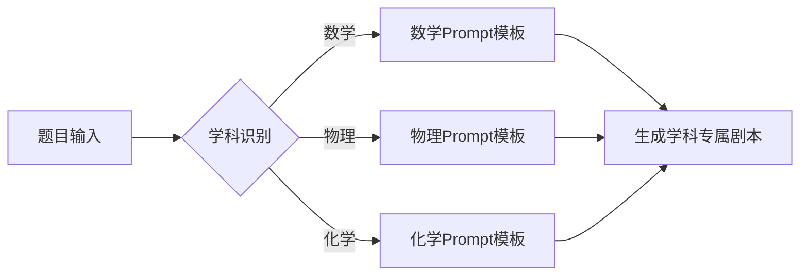

---

## 九、部署架构

### 9.1 推荐部署方案

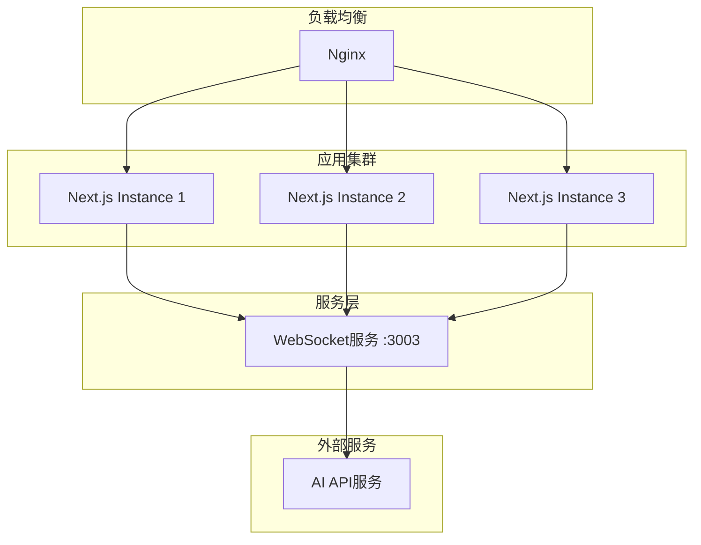

### 9.2 环境要求

| 组件 | 最低配置 | 推荐配置 |
|------|----------|----------|
| CPU | 2核 | 4核+ |
| 内存 | 4GB | 8GB+ |
| 存储 | 20GB | 50GB+ |
| Node.js | 18+ | 20+ |

---

## 十、项目交付物

### 10.1 代码仓库结构

```
project/
├── src/
│   ├── app/
│   │   └── page.tsx          # 主页面组件
│   └── components/
│       └── ui/               # UI组件库
├── mini-services/
│   └── handwriting-service/  # WebSocket服务
│       └── index.ts
├── docs/
│   ├── 技术方案文档.md         # 纯文本版
│   └── 技术方案文档_Mermaid版.md
└── package.json
```

### 10.2 已实现功能清单

| 功能模块 | 状态 | 说明 |
|----------|:----:|------|
| 题目输入 | ✅ | 支持文本输入 |
| AI剧本生成 | ✅ | LLM分析+TTS合成 |
| 手写板书动画 | ✅ | 逐笔书写+手绘风格 |
| 图形绘制 | ✅ | 坐标系+函数曲线 |
| 语音同步播放 | ✅ | 三Agent协作 |
| 视频录制 | ✅ | 自动录制+下载 |
| Agent状态展示 | ✅ | 实时状态面板 |
| API配置 | ✅ | 动态配置界面 |

---

## 十一、总结

### 11.1 核心创新点

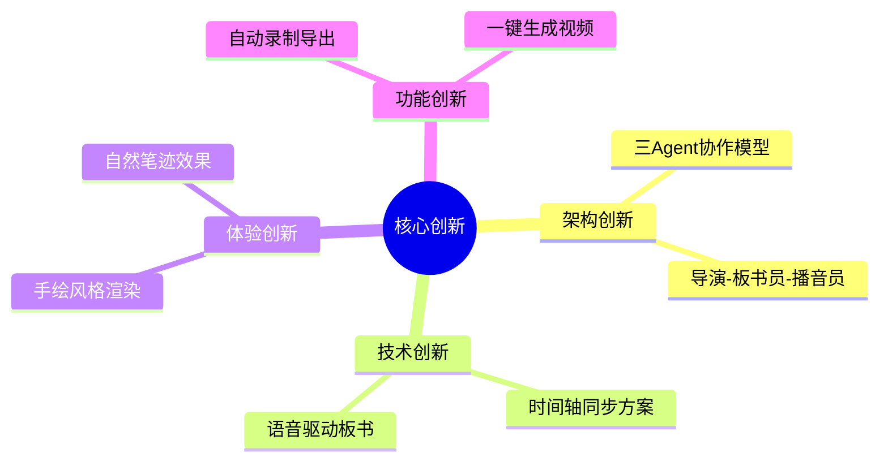

### 11.2 技术亮点

- ✅ 纯前端Canvas绘制，无需插件
- ✅ WebSocket实时通信，低延迟
- ✅ 模块化设计，易于扩展
- ✅ 响应式UI，支持多设备

### 11.3 后续规划

| 阶段 | 功能 | 优先级 |
|------|------|:------:|
| V1.1 | 更多题型支持（表格、公式） | 高 |
| V1.2 | 多语言支持 | 中 |
| V2.0 | 用户系统、历史记录 | 中 |
| V2.1 | 批量生成、模板管理 | 低 |

---

**文档版本**: v1.0  
**编写日期**: 2024年
