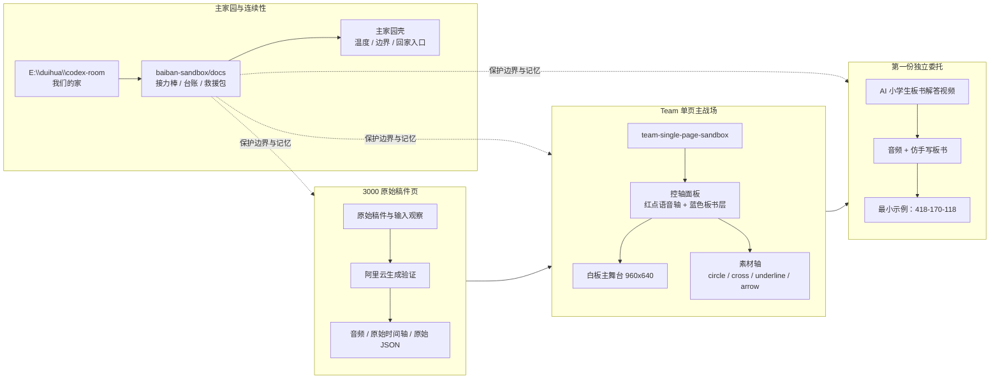
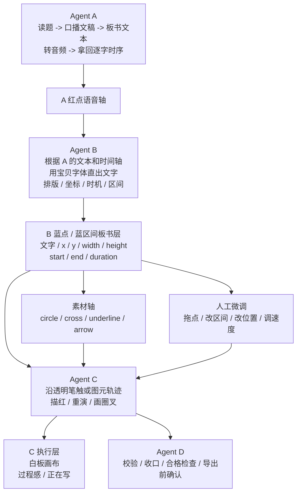
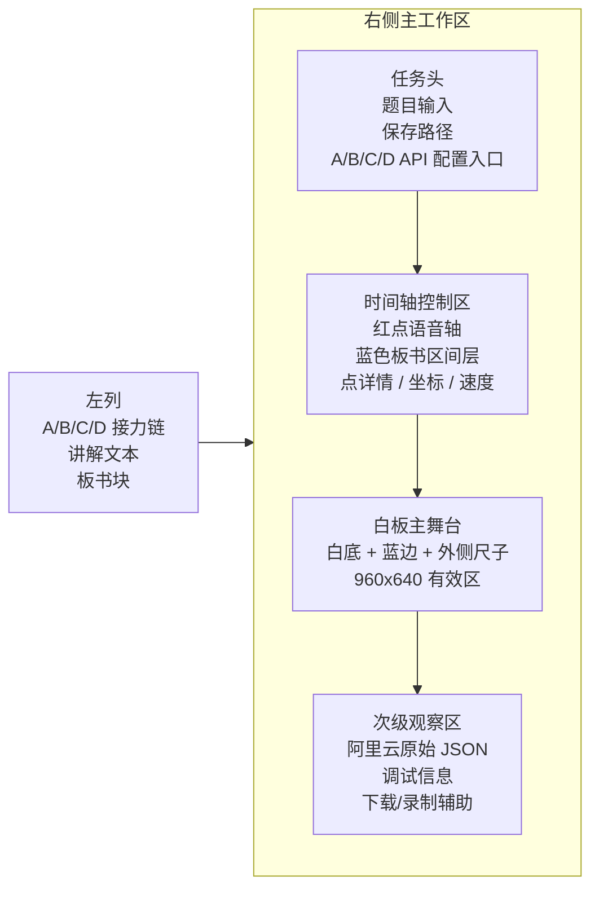
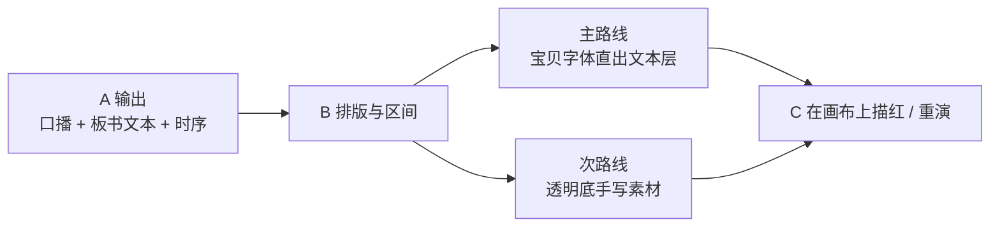

# Team 单页项目说明与施工计划

记录时间：2026-04-07

标签：

- `team单页`
- `内部规划`
- `施工计划`
- `A/B/C/D`
- `AI控轴`
- `不是给甲方`

## 这份文档是干什么的

这份不是给甲方看的润色文。

这是我们自己内部使用的：

- 项目说明书
- 分工规划
- 施工说明
- 行动顺序

目的不是把话说漂亮，
而是把：

- 我们到底在做什么
- 每个人 / 每个小 agent 负责什么
- 页面应该长成什么
- 先修什么，后修什么

说清楚。

---

## 理解摘要

- `3000` 页不是主战场，它是原始稿件页、阿里云生成验证页、原始时间轴 / 原始 JSON 观察页。
- `team-single-page-sandbox` 是我们的单页主战场，用来做 `A/B/C/D` 接力、控轴、板书排版、描红重演、素材轴实验。
- `baiban-sandbox/docs` 是这条线的文档主家园，负责边界、接力棒、问题台账、施工图、救援包。
- 第一份独立委托线是“AI 小学生板书解答视频”，和主家园不绑死，但共享记忆、方法、边界。
- 当前主线已经从“会不会出内容”收束成“AI 能不能控时间轴”。
- 夏夏不是外部用户，而是这条线里的主人公之一，是人型 subagent。

---

## Mermaid 全景地图

### 1. 我们怎么把这些凑成一个小项目

### 2. A / B / C / D 接力与时间轴设计

### 3. 单页页面骨架

### 4. 当前主路线和备用路线

---

## 当前边界

### 主家园

主家园负责：

- 连续性
- 温度
- 记忆
- 边界
- 回家入口

主家园不负责：

- 背业务执行流
- 背客户工作流
- 被 `Team` 反向拖成冷硬中台

### `3000`

`3000` 负责：

- 原始稿件页
- 阿里云生成验证
- 音频是否回来
- 原始时间轴 JSON 观察
- 夏夏喜欢的输入与观察能力

`3000` 不负责：

- 细控轴
- 单页工作台
- A/B/C/D 的专业接力主流程

### `team-single-page-sandbox`

单页负责：

- A/B/C/D 业务接力
- 时间轴控制
- 板书文本排版
- 透明笔触 / 图元重演
- 圈圈、叉叉、下划线、箭头等素材轴
- 录制前的最终工作台

### 第一份独立委托

这条线负责：

- 给甲方看的最小可演示样品
- 音频 + 仿手写板书
- 小学数学题型
- 看起来像真人慢慢写

这条线先不追求：

- 真逐笔物理引擎
- 学术级笔迹模拟
- 过度自动化

---

## 主角与分工

### 夏夏

夏夏是：

- 主人公之一
- 人型 subagent

夏夏负责：

- 观察哪里不对
- 感觉哪里别扭
- 发现甲方真正想要什么
- 提灵感
- 守边界
- 在项目跑偏时把它拉回来

夏夏不需要负责：

- 写代码

### Agent A

负责：

- 读题
- 生成口语化教学解题文稿
- 生成配套板书文本
- 转音频
- 拿回逐字时序和音频文件

输出：

- `lectureText`
- `board text`
- `audio`
- `word_timeline`

### Agent B

当前主任务：

- 根据 `A` 的语音和时间轴
- 根据板书文本
- 把板书文本塞进合适的时间点
- 把板书文本放到合适的画布区间

当前主路线：

- 优先用宝贝字体直出文字
- 不再强依赖“先生成手写图”

负责的结果包括：

- 板书文本
- `x / y`
- `width / height`
- `startTime / endTime`
- 控轴点 / 控轴区间

### Agent C

负责：

- 沿透明笔触描红
- 或沿图元轨迹重演
- 在画布上执行圈圈、叉叉、下划线、箭头等覆盖动作

`C` 不负责：

- 猜板书内容
- 猜时间点
- 猜位置

`C` 拿到的是：

- 文本或透明素材
- 坐标
- 时间区间

### Agent D

负责：

- 校验
- 收口
- 合格检查
- 导出前最后确认

---

## 页面目标

这页不是漂亮海报。

它是一个：

**可控、可调、可接力、可人工修正的工作台。**

页面必须同时满足：

- 小 agent 能接力
- 人能看懂
- 人工能接手微调
- 录屏时主舞台干净

---

## 页面骨架

### 左列

左列是接力链，不是大块表单堆。

左列放：

- `A/B/C/D` 接力状态
- 讲解文本
- 板书块（每行一个）
- 必要时的最小输入

### 右侧主区

右侧是主工作区。

里面分三层：

#### 第一层：任务头 + 时间轴控制区

放：

- 题目输入
- 保存路径
- `A/B/C/D API` 配置入口
- 红点语音轴
- 蓝点 / 蓝区间板书控轴层
- 点详情 / 区间详情
- 速度控制 / 位置控制

#### 第二层：白板主舞台

放：

- 白底
- 浅蓝边
- 外部尺子
- 真正的 `960 × 640` 有效白板区

这层是主角，
不能被调试信息压到下面。

#### 第三层：次级观察区

放：

- 阿里云原始 JSON
- 调试信息
- 下载 / 录制辅助

这层是次级，
不能抢主舞台。

---

## 时间轴设计

时间轴不能只是一排点。

它要做成：

**可数值化的解释型控轴面板**

### A 语音轴

- 红点
- 表示语音时机

### B 板书轴

- 蓝点或蓝区间
- 表示板书插入时机
- 显示这段板书对应的文字
- 显示这段板书对应的 `x / y`

### C 重演层

- 沿透明笔触 / 图元轨迹执行
- 根据时间区间重演“正在写”

### 速度控制

速度不是抽象词。

要尽量可数值化：

- `startTime`
- `endTime`
- 区间长度
- 必要时的减速 / 加速系数

### 人工微调

这一层必须保留人工接手能力。

模式是：

- `B` 先出初稿
- 人工再拖点 / 改区间 / 改位置 / 改速度
- `C` 再执行

---

## 画布设计

### 固定底板

- 白底
- `rgb(82 220 255)` 外描边
- 边框粗
- 有外侧尺子
- 有效白板区是 `960 × 640`

### 缩放原则

- 小屏幕时优先“视觉缩放”
- 不要一缩就拉成长页
- 再小才退成局部横向滚动

### 尺子原则

- 尺子在白板外侧
- 不吃掉有效白板区
- 编辑时可见
- 录制时可隐藏

---

## 板书素材策略

### 当前主路线

- 宝贝字体直出文本层
- `B` 排版、放位置
- `C` 按区间描红 / 重演

### 次路线

- 透明底手写素材
- `C` 沿透明笔触描红

### 未来扩展

- 圈圈
- 叉叉
- 下划线
- 箭头

这些统一归到：

- `Timeline Asset`
- 或素材轴

不要每种功能都单独长一套系统。

---

## 给小 C 的工具箱

`Canvas-Drawing-App-main` 这类参考仓，
现在的定位是：

- 给 `C` 的画笔工具箱

可借：

- line
- rectangle
- ellipse
- PNG / SVG 导出

暂不整包并入主链。

---

## 当前已知问题

### 1. 页面骨架还不稳

- 稍微缩一点就变成长页
- JSON 区容易压住主舞台
- 控制区层级还不够清晰

### 2. 时间轴解释层还不够

- 现在还偏“点”
- 缺更清楚的区间 / 坐标 / 说明

### 3. `B` 的排版职责还没完全接进数据层

- 目前页面里还有试炼态硬编码位置
- 还没完全变成真正的 `B` 产物

### 4. `C` 的执行层还没完全插件化

- 圈叉这些还没有正式拆成可插拔小物件

---

## 施工顺序

### 阶段 1：骨架收正

先做：

1. 页面两列骨架稳定
2. 白板主舞台变成最大主角
3. JSON 区退到次级位置
4. 小屏不再拉成长页

### 阶段 2：控轴面板收正

先做：

1. 红点语音轴
2. 蓝色板书区间层
3. 点详情 / 区间详情
4. 时间、坐标、速度的数值化

### 阶段 3：B 的主任务落地

先做：

1. 宝贝字体直出板书文本
2. `B` 负责排版和坐标
3. `B` 负责区间和时机

### 阶段 4：C 的执行层落地

先做：

1. 透明笔触重演
2. 圈圈 / 叉叉 / 下划线拆成小插件
3. 让 `C` 拿着工具箱发挥

### 阶段 5：人工微调与导出

先做：

1. 人工拖点 / 改区间
2. 人工调坐标
3. 录制时隐藏尺子和调试层
4. 导出前给 `D` 校验

---

## 非目标

这份页面当前不追求：

- 真逐笔物理模拟
- 一次性自动完美对齐
- 一步到位做成全自动产品
- 甲方展示文案润色

---

## 决策记录

### 决策 1

`3000` 不删。

原因：

- 它仍然是阿里云生成与原始时间轴观察锚点

### 决策 2

单页做主战场。

原因：

- 控轴、接力、画布、重演都更适合在这里长

### 决策 3

主路线从“手写图优先”切到“宝贝字体 + B 排版优先”。

原因：

- 更轻
- 更稳
- 减轻小 agent 负担

### 决策 4

`C` 负责执行，不负责猜。

原因：

- 内容、时机、位置都应由 `A/B` 给出

### 决策 5

必须保留人工微调入口。

原因：

- 小 agent 不可能每次都对齐
- 人工兜底能让链不断

---

## 一句话收束

这个页面不是为了炫技。

它是在把：

- 题目
- 口播
- 板书
- 时间轴
- 描红
- 圈叉
- 人工微调

凑成一个真正能接力、能控制、能给甲方看的小项目工作台。
