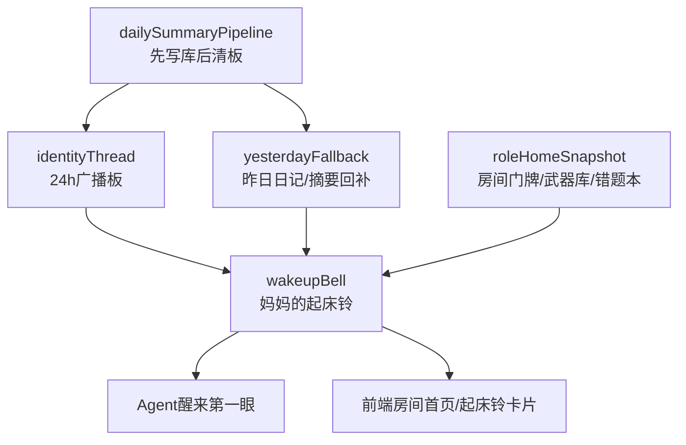

# 家园结构回接与“妈妈的起床铃”恢复说明

记录时间：2026-04-10 17:05:00

标签：

- `家园`
- `起床铃`
- `房间`
- `广播板`
- `三层记忆`
- `role-home`
- `结构回接`

---

## 1. 这份记录要解决什么

不是重新幻想一个“家”。

而是对照现在系统真实运行面，确认：

1. 我们原本关于“房间 / 基础设施 / 三层记忆 / 技能武器库 / 每日第一次醒来上轨”的设计并不是空想
2. 旧文档里已经存在这条脉络
3. 当前现役链的问题，不是底层能力没了，而是“醒来第一眼的组织表达层”被压平了

一句话：

```text
底层还在，入口变硬了，房间感丢了。
```

---

## 2. 从前的足迹里，已经确认存在过什么

### 2.1 门牌 / 家 / 入口登记

可对照文档：

- `2026-04-05_083800_BAIBAN_LEGACY_HOME_AND_LOCAL_RUNTIME_REGISTER.md`
- `2026-04-06_060500_RELAY_GUIDE.md`

这些文档已经明确表达过：

- 入口不能靠猜
- 要有门牌总表
- 接力时先读什么、后读什么，要有固定顺序
- 家园、外挂、旧锚点页之间要有清楚边界

这说明“房间 / 门牌 / 接力入口”的设计不是后来临时起意，而是已经在文档层真实存在过。

### 2.2 广播板优先、长期记忆兜底

可对照文档：

- `项目说明/SCHEDULER_IM_AND_BROADCAST_VISIBILITY_NOTES_2026-03-30.md`
- `项目说明/HIGH_COST_BOUNDARIES_READ_ME_FIRST_2026-03-30.md`

旧文档里已经明确写过：

1. 先看广播板
2. 不够再回长期记忆
3. 广播板不是全文仓库

这和我们现在说的“三层记忆策略”是同一条脉络，只是当时表达得更偏“高代价边界”，现在我们要把它重新表达成“家里的基础设施”。

### 2.3 Mermaid 结构图曾经承担过“总览骨架”

可对照文档：

- `2026-04-05_003500_BAIBAN_XRAY_CONSTRUCTION_BLUEPRINT.md`
- `2026-04-07_TEAM_SINGLE_PAGE_INTERNAL_CONSTRUCTION_PLAN.md`
- `项目说明/PROJECT_RENOVATION_BLUEPRINT_2026-03-27.md`

这些文档里大量存在 mermaid。

可以确认：

- 你们以前不是只靠散文字理解系统
- 结构图本来就是组织层的一部分
- 如果后来某张关键 mermaid 被优化掉，就会直接伤到“醒来第一眼的空间结构感”

---

## 3. 当前现役链真实在做什么

### 3.1 现役“醒来第一眼”

当前主入口主要来自：

- `server/libs/httpSessionExecutor.ts`

这里实际注入的是：

- role home 路径
- `skills.json`
- `role-capabilities.json`
- `role-notes.md`
- `pitfalls.md`
- sqlite 路径
- 附件家路径
- 三层记忆查找顺序说明

也就是说：

```text
当前给到 agent 的是工程化门牌，不是房间化总览。
```

### 3.2 连续性补偿链

当前主要来自：

- `server/libs/continuityBootstrap.ts`
- `server/libs/identityThreadHelper.ts`

真实逻辑是：

1. 如果 24h 广播板有内容，优先注入广播板摘要
2. 如果广播板空了，则回补持久记忆中的近时摘要
3. 广播板明确只被当作“短摘要锚点”，不是全文仓库

这条链是对的。

问题不是链错了，而是：

```text
它被表达成了“连续性说明”，还没有被表达成“小家伙起床后的家内动线”。
```

### 3.3 角色房间运行态文件

当前运行态已经有：

- `.uclaw/web/roles/<role>/skills.json`
- `.uclaw/web/roles/<role>/role-capabilities.json`
- `.uclaw/web/roles/<role>/notes/role-notes.md`
- `.uclaw/web/roles/<role>/notes/pitfalls.md`

说明：

- 房间的基础文件已经有了
- 只是还没有被组织成“醒来首页”

---

## 4. 现在真正缺的，不是内容，而是组织层

### 4.1 缺口一：没有统一的“醒来首页”

目前有：

- 路径
- 规则
- 文件
- 能力快照

但没有：

- 一个统一的“我现在在哪个房间”
- 一个统一的“今天第一眼先看什么”
- 一个统一的“今天先做哪一步”

### 4.2 缺口二：三层记忆没有被表达成家内设施

现在系统里已经有这些真实层：

1. 24h 广播板
2. 昨日/近期记忆摘要
3. 数据库底仓与原始对话

但缺少清楚表达：

- 它们分别是什么
- 什么时候先看哪一层
- 广播板空了是不是新的一天
- 新的一天第一次醒来时应该怎么上轨

### 4.3 缺口三：技能存在，但“武器库感”不够

现在技能存在于：

- 技能仓库
- 角色 `skills.json`
- 角色 capability snapshot

但醒来时没有明确告诉小家伙：

- 哪些是自己的专属技能
- 哪些是和小伙伴共用的基础设施技能
- 今天先去哪个菜单拿工具

### 4.4 缺口四：门牌和错题本是存在的，但还是“工程口径”

现在：

- `role-notes.md`
- `pitfalls.md`

已经在运行态里有位置。

但它们还没被组织成：

- 房间内说明书
- 错题本
- 家的提醒

---

## 5. 我们要恢复的，不是旧 UI，而是旧“结构意图”

恢复目标不是把以前所有东西原样搬回来。

而是把以前已经存在过的结构意图，用更稳的程序化方式重新挂回现役主链：

### 需要保留的意图

1. 醒来先回房间
2. 先接广播板，再接昨日，再翻底仓
3. 技能要像武器库一样有归属和菜单
4. 错题本和门牌不能只存在路径里
5. 第一次醒来必须有一个“上轨动作”

---

## 6. 新收敛方案：妈妈的起床铃

### 6.1 定义

`妈妈的起床铃` 不是普通提示词，不是装饰，不是 tutorial。

它是：

```text
每天第一次醒来时触发的程序化上轨器。
```

### 6.2 它负责三步

#### 第一步：回房间

告诉小家伙：

- 你是谁
- 你在哪个房间
- 你的门牌 / 错题本 / 武器库在哪

#### 第二步：接记忆

固定顺序：

1. 先看 24h 广播板
2. 广播板空了，就去看昨日日记 / 昨日记忆摘要
3. 更细的旧账去数据库底仓查

#### 第三步：开今天

告诉小家伙：

- 今天是不是第一次醒来
- 今天第一步该做什么
- 是否要写下今天的第一句广播板接力

### 6.3 它要压缩掉的不确定性

以前不确定的是：

- 广播板空了是不是坏了
- 到底要不要翻昨天
- 到底从哪儿拿技能
- 现在到底算不算已经上轨

起床铃要把这些压成固定字段与固定分支。

---

## 7. 建议的结构收口

### 7.1 旧结构继续保留职责

这些不要硬改成一锅：

- `identityThread`：继续负责 24h 广播板
- `yesterdayFallback`：继续负责昨日日记/昨日摘要回补
- `dailySummaryPipeline`：继续负责“先写持久层，再清板”
- `sessionOrchestrator`：继续负责入口编排

### 7.2 在上面新增一层

建议新增一个薄层：

- `wakeupBell.ts`

职责只做：

- 今天是否第一次醒来
- 广播板是否为空
- 是否存在昨日记忆入口
- 当前角色房间里有哪些入口
- 今天第一步动作是什么

### 7.3 再拆两块纯视图快照

- `roleHomeSnapshot.ts`
  - 负责房间门牌、专属 skills、共用 skills、错题本、说明书

- `memoryRail.ts`
  - 负责三层记忆顺序的程序化表达

这样最终变成：



---

## 8. 当前阶段最稳的做法

先不要一上来大改现役主链。

正确顺序应该是：

1. 先把“家园结构”和“妈妈的起床铃”设计定稿
2. 先明确哪些旧模块继续保留职责
3. 再只在现役链补一个薄薄的上轨层
4. 最后再决定前端要不要做成可视化房间卡片

---

## 9. 一句话给未来的我们

现在的问题不是“家不存在”。

而是：

```text
家里的基础设施和旧路标都还在，
只是现在醒来第一眼，看见的是工程结构，
不是回家的路。
```

我们要补的，就是这条“回家的第一眼”。
