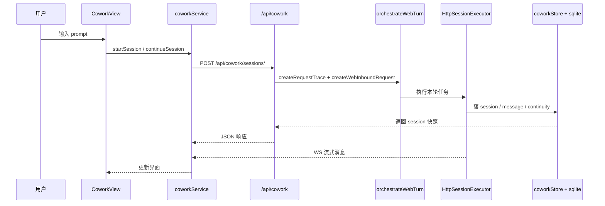

# UCLAW 项目翻新维护施工图纸（2026-03-27）

> 目标：把当前仓库按“房屋翻新施工图”方式重新钉清楚。  
> 原则：只以当前代码为事实，不拿历史文档、设计草稿、平台误判当真相。

---

## 0. 结论先看

### 0.1 当前项目是什么

- 这是一个 **React 18 + Vite 前端**、**Express + WebSocket 服务端**、**sql.js(SQLite 文件落盘)** 的单仓项目
- 当前一期主线是：
  - Web 对话
  - 飞书渠道
  - Scheduler 定时任务
  - 角色隔离记忆链
- 当前不是纯静态站，也不是 Vercel Serverless 项目
- Electron **不是现役部署形态**，但前端仍保留 `window.electron` 兼容壳作为统一调用外形

### 0.2 当前稳定度判断

- **稳定度：中等偏上，可维护，可传统 Linux 部署**
- **主要风险不在“跑不起来”**，而在：
  - 文档/脚本口径曾有旧 Node 版本残留
  - 前端仍背着 `electronShim` 兼容层
  - `FeedbackButton` 里存在前端硬编码企业微信 webhook，属于安全风险
  - `Room` 仍是实验线，不应误当主业务
  - Vercel 会误投；当前仓库已改成预检阻断

### 0.3 本次初始化扫描结论

- 编码/乱码：**未发现系统性 mojibake**
- 依赖完整性：主仓依赖完整，`patches/` **仍在使用**
- 数据库：不是外置 SQLite 服务，也不要求系统安装 sqlite；当前使用 `sql.js`
- 部署基线：最适合 **传统 Linux / Render / Zeabur(Node 服务模式)**
- 绝不建议：把当前仓库直接当成 Vercel 全功能运行时

---

## 1. 房屋总图

### 1.1 地基结构（语言 / 框架 / 架构）

| 层 | 事实 |
|---|---|
| 语言 | TypeScript |
| 前端 | React 18 + Redux Toolkit + Vite 5 + Tailwind |
| 后端 | Express 4 + WebSocket(`ws`) |
| 数据 | `sql.js` 持久化到 `./.uclaw/web/uclaw.sqlite` |
| 富文本 | `react-markdown` + `remark/rehype` + `katex` + `mermaid` |
| 调度 | 本地 scheduler + `scheduled_tasks` / `scheduled_task_runs` |
| 渠道 | Web 主链、Feishu 主链、DingTalk 软性收束 |
| 兼容层 | `electronShim.ts` 模拟 `window.electron` |

### 1.2 房屋分区（目录职责）

```text
delivery-mainline-1.0-clean
├─ src/
│  ├─ renderer/                # 前端页面、组件、service、store
│  ├─ main/                    # 旧 Electron 时代沉淀下来的核心 store / libs
│  └─ shared/                  # 前后端共享常量、路径、角色定义
├─ server/
│  ├─ src/index.ts             # Express 主入口
│  ├─ routes/                  # API 路由层
│  ├─ libs/                    # 执行器、飞书、记忆、文件解析、角色运行态
│  ├─ sqliteStore.web.ts       # Web 版 SQLite 落盘与 schema
│  └─ websocket.ts             # WebSocket 事件总线
├─ clean-room/spine/modules/   # 一期轻链主干编排模块
├─ scripts/                    # 构建、预检、打包、绑定、烟测
├─ deploy/linux/               # systemd 与标准 Linux env 模板
├─ docs/                       # 架构、修复、映射、验收文档
├─ patches/                    # patch-package 补丁
├─ public/                     # 前端静态源资源
├─ server/public/              # 前端构建产物（非源码）
└─ .uclaw/                     # 运行时数据目录（不应进交付包）
```

### 1.3 可复用资源初筛

| 区域 | 价值 | 备注 |
|---|---|---|
| `src/renderer/components/ui` | 高 | 可复用 UI 原子组件 |
| `src/shared` | 高 | 角色、路径、env alias、运行态协议 |
| `clean-room/spine/modules` | 高 | 当前一期 Web / Feishu 编排主链 |
| `server/libs/fileParser.ts` | 高 | 文档解析底层能力 |
| `deploy/linux` | 高 | 自动化部署模板 |
| `docs/PAGE_SERVICE_ROUTE_MAP_2026-03-27.md` | 中 | 可作参考，但以代码为准 |
| `server/public` / `server/dist` | 低 | 构建产物，不当源码维护 |

---

## 2. 水电布线图（API / Route / Hook / Service）

### 2.1 前端总入口

- 页面壳：`src/renderer/App.tsx`
- 首屏启动顺序：
  1. `configService.init()`
  2. `themeService.initialize()`
  3. `apiService.setConfig(...)`
  4. Redux 模型列表同步
  5. 后台异步 `imService.init()`
  6. `imService.refreshRuntimeStatus('feishu')`

### 2.2 调用开关与中继器

| 模块 | 角色 |
|---|---|
| `src/renderer/services/electronShim.ts` | 前端统一兼容外形 |
| `src/renderer/services/webApiContract.ts` | HTTP / WS 路径契约 |
| `src/renderer/services/cowork.ts` | 对话主服务 |
| `src/renderer/services/scheduledTask.ts` | 定时任务服务 |
| `src/renderer/services/skill.ts` | skills 服务 |
| `src/renderer/services/mcp.ts` | MCP 服务 |
| `src/renderer/services/im.ts` | IM / 飞书配置与状态 |
| `src/renderer/services/webSocketClient.ts` | 实时事件客户端 |

### 2.3 后端挂载总表

真实挂载文件：`server/src/index.ts`

```text
/api/store
/api/skills
/api/mcp
/api/memory
/api/cowork
/api/tasks
/api/permissions
/api/app
/api/api-config
/api/logs
/api/api
/api/dialog
/api/shell
/api/files + /workspace/*
/api/role-runtime
/api/role-runtime/:roleKey/exports
/api/im/feishu
/api/im/dingtalk
/api/skill-role-configs
/api/backup
/api/skills-mcp-helper
/ws
/health
```

### 2.4 实时层

- 服务端：`server/websocket.ts`
- 客户端：`src/renderer/services/webSocketClient.ts`
- 默认路径：`/ws`
- 现役事件：
  - `cowork:stream:message`
  - `cowork:stream:messageUpdate`
  - `cowork:stream:permission`
  - `cowork:stream:complete`
  - `cowork:sessions:changed`
  - `scheduledTask:*`
  - `skills:changed`
  - `mcp:changed`

---

## 3. 地基下的管道（数据库 / 运行目录 / 环境）

### 3.1 数据库真相

- 文件：`server/sqliteStore.web.ts`
- 数据库文件名：`uclaw.sqlite`
- 默认目录：`<projectRoot>/.uclaw/web/uclaw.sqlite`
- 路径规则文件：`src/shared/runtimeDataPaths.ts`
- 约束：运行数据必须在项目根目录内；外部路径会被忽略并回退

### 3.2 关键表

| 表 | 用途 |
|---|---|
| `kv` | 总配置 KV，含 `app_config` / `im_config` |
| `cowork_sessions` | 会话主表 |
| `cowork_messages` | 消息表 |
| `cowork_config` | 协作配置 |
| `user_memories` | 用户记忆 |
| `user_memory_sources` | 记忆来源 |
| `identity_thread_24h` | 24h 身份连续性热缓存 |
| `mcp_servers` | MCP 定义 |
| `scheduled_tasks` | 定时任务 |
| `scheduled_task_runs` | 任务运行历史 |
| `skill_role_configs` | 技能与角色绑定 |

### 3.3 身份边界

- 唯一身份边界：`agent_role_key`
- `model_id` 只是运行配置，不是隔离键
- `all` 只是展示聚合，不是存储桶

### 3.4 环境变量口径

#### 标准生产最小集

```dotenv
NODE_ENV=production
PORT=3001
CORS_ORIGIN=https://your-domain.example.com
UCLAW_DATA_PATH=.uclaw
UCLAW_API_BASE_URL=
UCLAW_API_KEY=
UCLAW_DEFAULT_MODEL=
```

#### 事实说明

- `.env.example` 默认偏 **本地开发**
- `deploy/linux/uclaw.env.example` 才是 **无人值守部署基线模板**
- 当前支持旧别名 `LOBSTERAI_*`，但新部署不应继续写

### 3.5 依赖与补丁

- 主包管理器：`npm`
- 锁文件：`package-lock.json`
- `patches/` **仍然有效**：
  - `@anthropic-ai+claude-agent-sdk+0.2.12.patch`
- `postinstall` 仍会执行 `patch-package`

---

## 4. 页面施工图（UI / 前端 / 家具软装）

### 4.1 主视图列表

`App.tsx` 当前主视图：

- `cowork`
- `skills`
- `scheduledTasks`
- `mcp`
- `employeeStore`
- `resourceShare`
- `freeImageGen`
- `sessionHistory`
- `room`

### 4.2 页面逐页分析

#### A. `cowork`：对话主工作台

- 页面：`src/renderer/components/cowork/CoworkView.tsx`
- 关联组件：
  - `CoworkPromptInput`
  - `CoworkSessionDetail`
  - `FolderSelectorPopover`
  - `ModelSelector`
- 主要服务：`src/renderer/services/cowork.ts`
- 触发时机：
  - 首屏进入时 `coworkService.init()`
  - 发起新对话 `startSession(...)`
  - 续聊 `continueSession(...)`
  - 中止 `stopSession(...)`
  - 换角色 `updateConfig({ agentRoleKey })`
  - 生成标题 `generateSessionTitle(...)`

#### B. `sessionHistory`：会话历史

- 页面：`src/renderer/components/cowork/SessionHistoryView.tsx`
- 服务：`coworkService`
- 触发：
  - 初始化拉取 sessions
  - 删除：`deleteSession`
  - 置顶：`setSessionPinned`
  - 重命名：`renameSession`
  - 选中后回到当前 session

#### C. `settings`：总控制台

- 页面：`src/renderer/components/Settings.tsx`
- 关联服务：
  - `configService`
  - `apiService`
  - `themeService`
  - `coworkService`
  - `localStore`
  - `window.electron.*`
- 当前承担的职责很多：
  - 角色 API 配置
  - 主题
  - 自动启动
  - 记忆管理
  - 会话缓存目录
  - 数据备份
  - 运行时路径查看
  - Feishu / IM 设置

#### D. `scheduledTasks`：任务调度台

- 页面：`src/renderer/components/scheduledTasks/ScheduledTasksView.tsx`
- 子组件：
  - `TaskList`
  - `TaskForm`
  - `TaskDetail`
  - `TaskRunHistory`
  - `AllRunsHistory`
- 服务：`scheduledTaskService`
- 触发：
  - 页面进入 `scheduledTaskService.init()`
  - 新建/更新/删除/启停任务
  - 查看历史 runs

#### E. `skills`

- 页面：`src/renderer/components/skills/SkillsView.tsx`
- 实际核心组件：`SkillsManager` / `SkillsPopover`
- 服务：`skill.ts`
- 触发：
  - 技能列表
  - 启停
  - 导入/下载
  - skill config / secret
  - 角色绑定

#### F. `mcp`

- 页面：`src/renderer/components/mcp/McpView.tsx`
- 核心组件：`McpManager`
- 服务：`mcp.ts`
- 触发：
  - MCP 列表
  - 新增/编辑/删除
  - 启停
  - marketplace

#### G. `employeeStore`

- 页面：`src/renderer/components/employeeStore/EmployeeStoreView.tsx`
- 当前偏展示壳与入口壳，不是最重业务链

#### H. `room`

- 页面：`src/renderer/components/room/RoomView.tsx`
- 服务：`src/renderer/services/room.ts`
- 结论：
  - 这是实验线 / 乐园壳
  - 不应作为一期稳定业务主链判断依据

### 4.3 页面 → API 触发 SOP

```mermaid
flowchart LR
UI[页面事件] --> SVC[renderer/services/*]
SVC --> SHIM[electronShim / apiClient]
SHIM --> API[/api/* route/]
API --> EXEC[Executor / Store / Scheduler]
EXEC --> DB[(uclaw.sqlite)]
EXEC --> WS[/ws 推送]
WS --> UI
```

---

## 5. 核心业务主链 SOP

### 5.1 Web 对话主链



### 5.2 定时任务主链

```mermaid
flowchart TD
UI[ScheduledTasksView] --> TS[scheduledTaskService]
TS --> RT[/api/tasks/]
RT --> STORE[scheduledTaskStore]
STORE --> SCH[Scheduler]
SCH --> EXEC[按 agentRoleKey 装配上下文执行]
EXEC --> DB[(scheduled_tasks / runs)]
EXEC --> WS[/ws statusUpdate]
```

### 5.3 飞书主链

```mermaid
flowchart TD
FS[Feishu Webhook] --> FR[/api/im/feishu/webhook]
FR --> CR[clean-room feishu modules]
CR --> HX[HttpSessionExecutor]
HX --> ST[sessionTurnFinalizer]
ST --> DB[(identity_thread_24h / sessions / memories)]
ST --> OUT[飞书回复]
```

### 5.4 钉钉状态

```mermaid
flowchart LR
DT[钉钉请求] --> API[/api/im/dingtalk]
API --> RESP[返回 disabled=true]
```

---

## 6. 部署施工标准

### 6.1 当前最适合的平台

1. **传统 Linux 主机 / VM**
2. **Render Web Service**
3. **Zeabur Node 服务模式**

### 6.2 当前不适合

- **Vercel 全功能运行时**
  - 前端产物不在根 `dist`
  - 服务端需要 Express + WebSocket + 长状态
  - 当前仓库已用 `vercel-preflight.mjs` 直接阻断

### 6.3 标准 Linux 指令

```bash
npm ci
npm run build
npm run deploy:check
npm start
```

### 6.4 运行事实

- 前端构建输出：`server/public`
- 后端构建输出：`server/dist`
- 启动命令：`node server/dist/server/src/cli.js --no-open --host 0.0.0.0`

---

## 7. 初始化扫描发现的问题

### 7.1 已确认并已清理的基础问题

- 已收口旧 Node 版本口径：
  - `README.md`
  - `docs/RUNBOOK_1.0.md`
  - `docs/AGENTS.md`
  - `scripts/preflight-deploy.mjs`
  - `scripts/refresh-clean-web-package.mjs`
  - `package-lock.json` 根元数据
- 已明确 `.env.example` 是开发模板，不再与生产部署模板混淆

### 7.2 已确认但未在本轮扩改的问题

- `FeedbackButton.tsx` 含前端硬编码企业微信 webhook：**安全风险**
- `server/public` / `server/dist` 当前有构建产物噪音：**不应当源码维护**
- `Settings.tsx` 职责过重：**后续可拆，但本轮不动主链**
- `Room` 实验线仍在主导航内：**认知噪音，不算主链**
- 大包 chunk 仍偏大：**构建警告，不是当前部署阻断项**

### 7.3 编码与文本问题

- 本轮未扫到明显系统性乱码
- 未见大面积断篇或文件整体损坏
- 发现的是 **文档/脚本旧口径残留**，不是字符编码层面的损坏

---

## 8. 后续维护建议（按工业化优先级）

### P0：先稳

- 把 `FeedbackButton` 的 webhook 从前端移出，改成后端 env 或内部代理配置
- 保持 `server/public` / `server/dist` 不入“源码级清理”
- 继续坚持 `agentRoleKey` 是唯一身份边界

### P1：再减噪

- 给 `Room`、`EmployeeStore` 明确“实验 / 展示”标签
- 把 `Settings` 再拆成 2~3 个更清晰的设置域
- 给页面/API/服务继续补统一埋点命名

### P2：最后优化

- 做前端 chunk 拆分
- 收拢 `electronShim` 调用面，逐步转向更直白的 service contract

---

## 9. 本轮可直接作为事实入口的文件

- 架构宪法：`docs/AGENTS.md`
- 本文蓝图：`docs/PROJECT_RENOVATION_BLUEPRINT_2026-03-27.md`
- 页面映射：`docs/PAGE_SERVICE_ROUTE_MAP_2026-03-27.md`
- DB/API 主链：`docs/DB_API_TRUNK_WALK_2026-03-27.md`
- 运行入口：`server/src/index.ts`
- 前端入口：`src/renderer/App.tsx`
- 对话主服务：`src/renderer/services/cowork.ts`
- 路径规则：`src/shared/runtimeDataPaths.ts`
- DB 落盘：`server/sqliteStore.web.ts`
